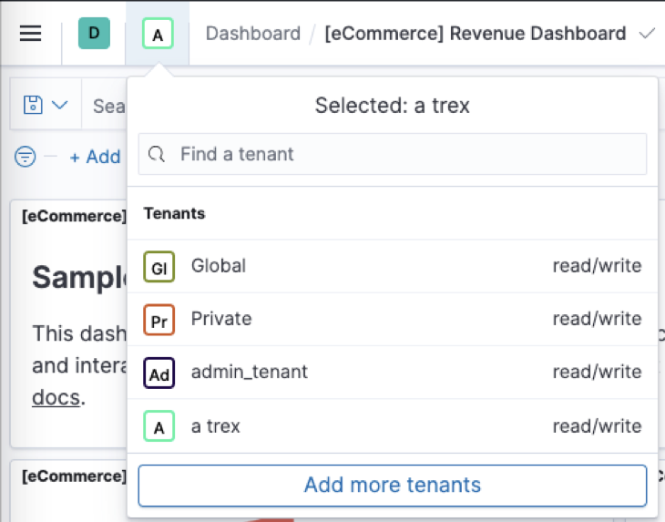

<!--- Copyright 2021 floragunn GmbH -->


# Search Guard Kibana Plugin 51.0

**Release Date: 2021-06-08**


This release of the Search Guard Kibana plugin brings a number of UX improvements and bug fixes. If you are using OIDC for authenticating in Kibana, there is one breaking change you need to take care of. See below for details.

## Breaking Changes

### Handling of Kibana shared links with OIDC

The mechanism how the Kibana plugin handles Kibana shared links while authenticating with OpenID Connect has changed. This requires that you must change your IDP configuration if you are using shared links and OIDC configuration. Please locate the configuration for valid redirect URIs of the Kibana authentication domain in your IDP. Then, you need to append an asterisk `*` to the URIs configured here. So, for example `https://kibana.example.com:5601/auth/openid/login` becomes `https://kibana.example.com:5601/auth/openid/login*`.

This change is necessary to avoid authentication problems for very long share URIs.

Details:

* [Issue](https://git.floragunn.com/search-guard/search-guard-kibana-plugin/-/issues/363)
* [Merge request](https://git.floragunn.com/search-guard/search-guard-kibana-plugin/-/merge_requests/730)
* [Using Keycloak for authenticating with OIDC in Search Guard](https://search-guard.com/kibana-openid-keycloak/)  

#### Updating the configuration in Keycloak

* Navigate to "Clients" 
* Select the client wich represents Kibana with the Search Guard plugin
* On the "Settings" tab, locate the "Valid Redirect URIs" field. 
* Append * to all entries
* Click on "Save"

## Improvements and new features

### New Tenant Selection

The way you switch between different Kibana tenants has changed. The new selection can be found in the main Kibana navigation bar right next to the name of the current page. Click on the square with the colored border (labeled "A" in the example shown below) to see a list of all available tenants. Just click on one tenant to select it.

<!-- p align="center">

</p -->

The old tenant selection page has been removed.

Details:

* [Issue](https://git.floragunn.com/search-guard/search-guard-kibana-plugin/-/issues/314)
* [Merge request](https://git.floragunn.com/search-guard/search-guard-kibana-plugin/-/merge_requests/718)

### Account Information

The account information page displays basic information about the logged in user; this information is mainly useful for trouble-shooting. Originally, the page was reachable by the "Account Information" link in the dropdown menu and was disabled by default. It is now available just by clicking on the user icon in the top right corner and then clicking on the user name. This link is now enabled by default.

* [Issue](https://git.floragunn.com/search-guard/search-guard-kibana-plugin/-/issues/314)
* [Merge request](https://git.floragunn.com/search-guard/search-guard-kibana-plugin/-/merge_requests/718)

### Signals: View and edit the JSON source of watches

You can now read and edit the JSON document of a graph or blocks watch. Just go the watch overview, click on the "..." button next to a watch and click on "JSON" in the appearing popup.

Details:

* [Issue](https://git.floragunn.com/search-guard/search-guard-kibana-plugin/-/issues/322)
* [Merge request](https://git.floragunn.com/search-guard/search-guard-kibana-plugin/-/merge_requests/727)


### Kibana demo config installer

Installing test configurations of the Search Guard Kibana plugin is facilitated by a new installer script. Just run the demo installer script and select the config you want. The script will create the basic configuration and TLS certificates. 

Linux: 

```
cd kibana/plugins/searchguard
./install_demo_configuration.sh
```

Windows: 

```
cd kibana\plugins\searchguard
powershell —ExecutionPolicy Bypass -File install_demo_configuration.ps1
```

Details:

* [Issue](https://git.floragunn.com/search-guard/search-guard-kibana-plugin/-/issues/313)
* [Merge request](https://git.floragunn.com/search-guard/search-guard-kibana-plugin/-/merge_requests/674)

### Search Guard authentication configuration page is now hidden by default

The authentication page in the Search Guard configuration section of the Kibana plugin never provided any possibility to edit the configuration. Thus, it is only of limited use. However, particularly this configuration can contain sensitive information which should not be made easily accessible. Thus, this page is disabled by default now.

To re-enable this page, add this to `kibana.yml`: 

```
searchguard.configuration.auth_page.enabled: true
```

Details:

* [Issue](https://git.floragunn.com/search-guard/search-guard-kibana-plugin/-/issues/342)
* [Merge request](https://git.floragunn.com/search-guard/search-guard-kibana-plugin/-/merge_requests/700)

## Bugfixes


### Kibana index migration from 7.12.0 to 7.12.1

Search Guard 50 for Kibana 7.12 could not complete index migrations from Kibana 7.12.0 to 7.12.1. This is now fixed.

Details:

* [Issue](https://git.floragunn.com/search-guard/search-guard-kibana-plugin/-/issues/367)
* [Merge request](https://git.floragunn.com/search-guard/search-guard-kibana-plugin/-/merge_requests/732)


### Creation of API Auth Tokens

API auth tokens created with the Kibana UI could not be retrieved before. Now, the tokens are displayed directly after they are created. For security reasons, it is however not possible to retrieve the tokens again later.

Details:

* [Issue](https://git.floragunn.com/search-guard/search-guard-kibana-plugin/-/issues/339)
* [Merge request](https://git.floragunn.com/search-guard/search-guard-kibana-plugin/-/merge_requests/726)


### Preserve the tenant between sessions

If you select a tenant, log out and then log in, the Kibana plugin now preserves the last selected tenant as active.

Details:

* [Issue](https://git.floragunn.com/search-guard/search-guard-kibana-plugin/-/issues/363)
* [Merge request](https://git.floragunn.com/search-guard/search-guard-kibana-plugin/-/merge_requests/730)


### Shared Kibana links now preserve tenants

Now you can share a dashboard link and have the selected tenant in that link (sg\_tenant parameter). 

Details:

* [Merge request](https://git.floragunn.com/search-guard/search-guard-kibana-plugin/-/merge_requests/718)

### User name in user menu

For some users, the user menu did not properly display the name of the logged in users. This is now fixed.

Details:

* [Issue](https://git.floragunn.com/search-guard/search-guard-kibana-plugin/-/issues/352)
* [Merge request](https://git.floragunn.com/search-guard/search-guard-kibana-plugin/-/merge_requests/705)


### Signals: Issues with tenant names with special characters

The Watches page was broken if the tenant name included some special characters because the tenant name was not encoded.

Details:

* [Issue](https://git.floragunn.com/search-guard/search-guard-kibana-plugin/-/issues/368)
* [Merge request](https://git.floragunn.com/search-guard/search-guard-kibana-plugin/-/merge_requests/733)

### Signals: Adding checks to actions

It was not possible to add checks in the action because of an error.

Details:

* [Issue](https://git.floragunn.com/search-guard/search-guard-kibana-plugin/-/issues/361)
* [Merge request](https://git.floragunn.com/search-guard/search-guard-kibana-plugin/-/merge_requests/727)


### Signals: Cancel button on Update/Create Watch page

The Cancel button on Update/Create Watch page did not work in Firefox browsers. Fixed.

Details:

* [Issue](https://git.floragunn.com/search-guard/search-guard-kibana-plugin/-/issues/319)
* [Merge request](https://git.floragunn.com/search-guard/search-guard-kibana-plugin/-/merge_requests/724)