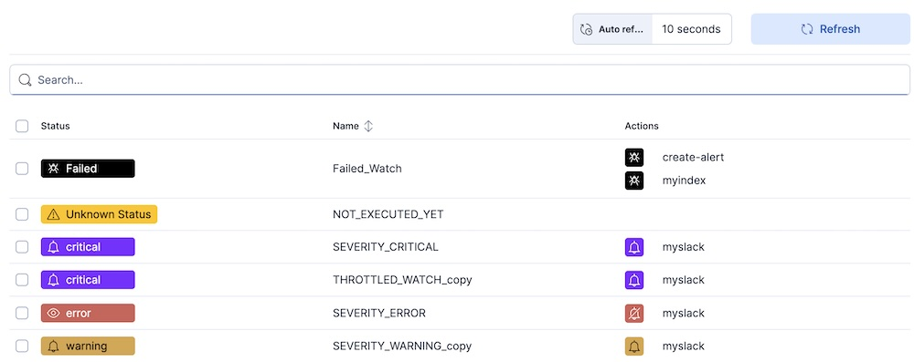
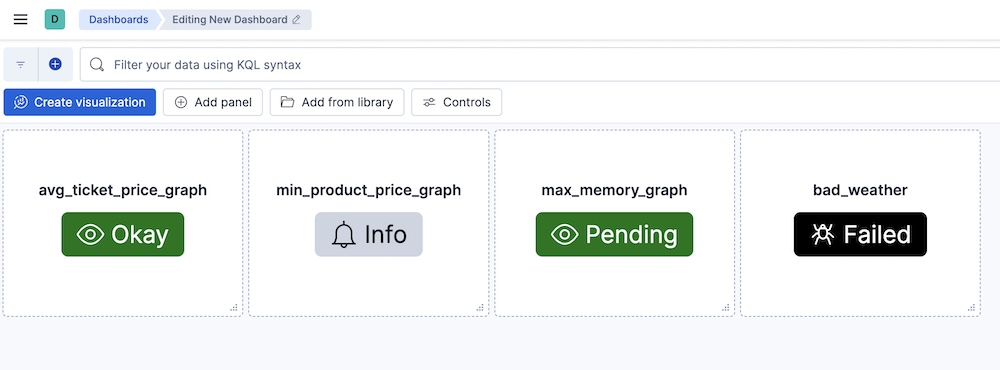

<!--- Copyright 2024 floragunn GmbH -->
# Search Guard FLX 4.0.0

**Release Date: 2025-11-04**

This version introduces backwards-incompatible changes. The system administrator must confirm that none of changes introduced in the version 4.0.0 will impact their deployment before upgrading to Search Guard FLX 4.0.0 or a newer version. It is strongly recommended to conduct testing in a non-production environment. Additionally, all necessary backup and rollback procedures should be established before initiating the upgrade.

## Breaking changes
### Removed the Bouncy Castle security provider
Search Guard now defaults to using the Java Cryptography Extensions (JCE) for providing cryptographic functionality instead of using the "Bouncy Castle" library. In most common deployments, this should not cause issues. However, if obscure or obsolete cyphers or formats are being used, these might no longer be supported by the JCE. Thus, thorough testing is recommended. The change may affect:
- TLS connections (e.g., between nodes, between clients and nodes, between Kibana and Elasticsearch, connections with LDAP, Kerberos, HTTP requests sent by Signals, etc.)
- JWT signature verification
- Authentication with OIDC and SAML
- Supported formats of X.509 certificates and other operations on X.509 certificates
- Some formats of private keys might not be supported anymore.
- Any other cryptographic operation performed by Search Guard

* [Merge Request](https://git.floragunn.com/search-guard/search-guard-suite-enterprise/-/merge_requests/1138)

### Removed legacy configuration format
Support for configuration stored in `sg_config.yml` (the format used before SG FLX 1.0.0) has been removed. If you have already migrated to the new Search Guard FLX configuration format using `sg_authc.yml`, you do not have to do anything. If you are still using `sg_config.yml`, follow the [migration guide](sg-classic-config-migration-overview). This needs to be completed **before** you update to FLX 4.0.0 or newer.

All APIs dedicated to modifying the `sg_config` version type have been removed.

* [Issue](https://git.floragunn.com/search-guard/search-guard-suite-enterprise/-/issues/426)
* [Merge Request](https://git.floragunn.com/search-guard/search-guard-suite-enterprise/-/merge_requests/1101)

### TLS on the REST layer is enabled by default
The new value of configuration parameter `searchguard.ssl.http.enabled` is `true` by default. If you want to disable TLS on the REST layer, set it to `false`. However, we strongly recommend keeping it enabled in production environments.

* [Issue](https://git.floragunn.com/search-guard/search-guard-suite-enterprise/-/issues/108)
* [Merge Request](https://git.floragunn.com/search-guard/search-guard-suite-enterprise/-/merge_requests/1289)

### Action groups `type` attribute is mandatory
The `type` attribute in action groups is now mandatory. If it is not specified, then a validation error will be reported. System administrators should upgrade each custom action group to include this value before upgrading to Search Guard FLX 4.0.0 or newer. For details, see [the documentation](action-groups#permissions-and-action-groups).

* [Issue](https://git.floragunn.com/search-guard/search-guard-suite-enterprise/-/issues/605)
* [Merge Request](https://git.floragunn.com/search-guard/search-guard-suite-enterprise/-/merge_requests/1292)

### Audit log REST request body handling changes
REST request bodies are now only included in audit logs for authenticated requests. In other cases, the audit log will not contain the HTTP request body.

* [Merge Request](https://git.floragunn.com/search-guard/search-guard-suite-enterprise/-/merge_requests/1285)

### Audit log bulk request body logging is disabled by default
The new configuration parameter `searchguard.audit.ignore_request_bodies` is set to `["BulkRequest", "indices:data/write/bulk", "*/_bulk*"]` by default. If you want to enable logging of bulk request bodies, overwrite this parameter with an empty list.

* [Merge Request](https://git.floragunn.com/search-guard/search-guard-suite-enterprise/-/merge_requests/1291)

### Support for TLS 1.0 and TLS 1.1 has been dropped
- Outdated and insecure SSL/TLS protocols are now blocked to enhance system security. The administrator is unable to enable obsolete protocols.
- Administrators will receive a clear error message if they attempt to enable deprecated protocols in the configuration.
- Default configurations have been updated to use only secure protocols.
- Use of insecure ciphers and protocols (such as SSLv3, TLS 1.0, TLS 1.1, and weak export ciphers) is no longer permitted.

These changes help ensure compliance with modern security standards and reduce the risk of vulnerabilities.

* [Issue](https://git.floragunn.com/search-guard/search-guard-suite-enterprise/-/issues/449)
* [Merge Request](https://git.floragunn.com/search-guard/search-guard-suite-enterprise/-/merge_requests/1152)

## New features

### Signals Alerting operator view in Kibana
Signals Alerting has a new "operator view" that highlights the current state of existing watches, rather than focusing on watch management.
The operator view is now the default Signals Alerting view.

    

* [Documentation](elasticsearch-alerting-operator-view)
* [Issue](https://git.floragunn.com/search-guard/search-guard-kibana-plugin/-/issues/523)
* [Merge Request](https://git.floragunn.com/search-guard/search-guard-kibana-plugin/-/merge_requests/1064)

### Signals Alerting watch status panel in Kibana dashboards
There is a new Signals Alerting watch status panel that can be added to Kibana dashboards. Each panel shows the status
of the given watch, and any watch that has severity levels defined can be added.

    

* [Documentation](elasticsearch-alerting-operator-view)
* [Issue](https://git.floragunn.com/search-guard/search-guard-kibana-plugin/-/issues/482)
* [Merge Request](https://git.floragunn.com/search-guard/search-guard-kibana-plugin/-/merge_requests/1072)

### JWT and OIDC authenticators: configurable maximum clock skew
Added support for configuring the maximum allowed clock skew for JWT authentication in both JWT and OIDC authenticators. System administrators can now set the `jwt.max_clock_skew_seconds` and `oidc.max_clock_skew_seconds` parameters to control how much time difference is tolerated between server and token issuer clocks. Default maximum clock skew is set to 10 seconds, but this can be adjusted as needed for your environment.

* [Issue](https://git.floragunn.com/search-guard/search-guard-suite-enterprise/-/issues/540)
* [Merge Request](https://git.floragunn.com/search-guard/search-guard-suite-enterprise/-/merge_requests/1305)

## Improvements

### LDAP follow referrals configuration

A new configuration option has been added to Search Guard's LDAP authentication, allowing administrators to control the handling of LDAP referrals.

- New Configuration Option: `follow_referrals` parameter has been added to the LDAP authentication configuration
- Purpose: Controls whether LDAP referrals should be followed during authentication and user lookup operations
- Default Value: `true` (maintains backward compatibility with previous behavior)

Please see [the documentation](active-directory-ldap-advanced#connection-settings).

* [Merge Request](https://git.floragunn.com/search-guard/search-guard-suite-enterprise/-/merge_requests/1252)

### Improved log message when JWT token validation fails due to `nbf` claim

When a login attempt fails because an OIDC/JWT token is not yet valid, the system now logs the token's "not before" (nbf) timestamp so the reason is explicit in the logs.

* [Merge Request](https://git.floragunn.com/search-guard/search-guard-suite-enterprise/-/merge_requests/1254)

### Signals Alerting - allow disabling of HTML body in email actions in the UI
It is now possible to disable the html_body attribute in email actions in the Signals Alerting UI.
If disabled, the html_body attribute will be omitted instead of returned as an empty string.
* [Issue](https://git.floragunn.com/search-guard/search-guard-kibana-plugin/-/issues/321)
* [Merge Request](https://git.floragunn.com/search-guard/search-guard-kibana-plugin/-/merge_requests/1063)

### Preventing unnecessary decryption attempts of JWTs
During authentication with JSON Web Tokens, or JWTs, Search Guard attempts to decrypt the token when the token is actually encrypted.

* [Issue](https://git.floragunn.com/search-guard/search-guard-suite-enterprise/-/issues/419)
* [Merge Request](https://git.floragunn.com/search-guard/search-guard-suite-enterprise/-/merge_requests/1313)

## Bug fixes

### FLS rules which grant access to object subfields did not work correctly
Inclusive FLS rules for object-valued properties were not properly supported in previous versions of Search Guard. In addition to the rule for the object-valued property itself, additional rules for the sub-properties were needed to properly allow access to the whole object. This has been fixed. Now, an inclusive rule for the top-level property is sufficient.

* [Merge Request](https://git.floragunn.com/search-guard/search-guard-suite-enterprise/-/merge_requests/1256)

### Async search status
Search Guard has been enhanced to support the asynchronous search status request functionality, allowing users to be granted permission to access the endpoint `GET /_async_search/status/{id}`. In previous versions, the REST endpoint was not available to the users.

- User can now check the status of asynchronous searches using the `/_async_search/status/{id}` endpoint if she or he have assigned permission `cluster:monitor/async_search/status`
- Only the user who initiated an async search can view its status (ownership-based access control)
- The `SGS_CLUSTER_COMPOSITE_OPS_RO` action group now includes the `cluster:monitor/async_search/status` permission
- Users with the special permission `indices:searchguard:async_search/_all_owners` can bypass ownership checks and view the status of any async search

### LDAP - TLS setup improvements

Added support for using LDAPS (LDAP over SSL) with default Java TLS settings if no explicit TLS configuration is provided. In previous versions, plain LDAP \(`ldap://`\) was used if no explicit TLS configuration was provided.

Improved detection and handling of mixed `ldap://` and `ldaps://` host configurations; LDAPS will be used for all if any host uses it.

* [Issue](https://git.floragunn.com/search-guard/search-guard-suite-enterprise/-/issues/258)
* [Merge Request](https://git.floragunn.com/search-guard/search-guard-suite-enterprise/-/merge_requests/1303)

### `sgctl`: corrected a bug that occurred during user creation with uncommon characters in the username
The `sgctl` command did not allow creating users with certain special characters (e.g., `/`, `?`, `&`, etc.) when the user name was specified on the command line. This has been fixed.

* [Issue](https://git.floragunn.com/search-guard/sgctl/-/issues/71)
* [Merge Request](https://git.floragunn.com/search-guard/sgctl/-/merge_requests/311)

### Security Fixes
This release resolves an issue where DLS rules were not correctly applied during Signals watch execution, which could result in alerts exposing information beyond a user’s permissions. DLS is now enforced properly, preventing any unauthorized data from being revealed.

Details will be made available on the [CVE Advisory Page](https://search-guard.com/cve-advisory/).

* [DLS Role Parsing Fails with AuthTokens Fix](https://git.floragunn.com/search-guard/search-guard-suite-enterprise/-/merge_requests/1312)

## More fixes

This update includes a number of further minor fixes. See [the Gitlab milestone](https://git.floragunn.com/groups/search-guard/-/milestones/17) for all details.
