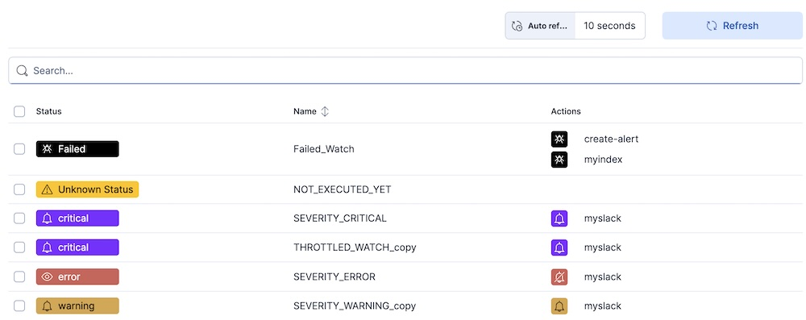
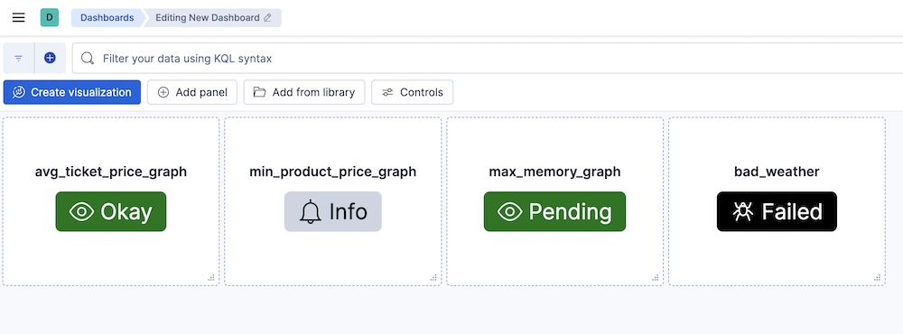

<!--- Copyright 2024 floragunn GmbH -->
# Search Guard FLX 4.0.0

**Release Date: TBD**

This version introduces backwards-incompatible changes. The system administrator must confirm that none of changes introduced in the version 4.0.0 will impact their deployment before upgrading to Search Guard FLX 4.0.0 or a newer version. It is strongly recommended to conduct testing in a non-production environment. Additionally, all necessary backup and rollback procedures should be established before initiating the upgrade.

## Breaking changes
### Removed the Bouncy Castle security provider
This results in a reduced number of supported cryptographic algorithms. Cryptographic algorithms are now provided by the default Java Cryptography Extension (JCE). **In the most common deployments, this should not cause issues**. However, before upgrading to Search Guard FLX 4.0.0 or newer, we recommend performing tests (e.g., in a test environment) to ensure that all required cryptographic algorithms are still supported. This change may affect:
- TLS connections (e.g., between nodes, between clients and nodes, between Kibana and Elasticsearch, connections with LDAP, Kerberos, HTTP requests sent by Signals, etc.)
- JWT signature verification
- Authentication with OIDC and SAML
- Supported formats of X.509 certificates and other operations on X.509 certificates
- Some formats of private keys might not be supported anymore.
- Any other cryptographic operation performed by Search Guard

* [Merge Request](https://git.floragunn.com/search-guard/search-guard-suite-enterprise/-/merge_requests/1138)

### Removed legacy configuration format
Support for configuration stored in `sg_config.yml` (the format used before SG FLX 1.0.0) has been removed. If you have already migrated to the new Search Guard FLX configuration format using `sg_authc.yml`, you do not have to do anything. If you are still using `sg_config.yml`, follow the [migration guide](sg-classic-config-migration-overview). This needs to be completed **before** you update to FLX 4.0.0 or newer.

* [Issue](https://git.floragunn.com/search-guard/search-guard-suite-enterprise/-/issues/426)
* [Merge Request](https://git.floragunn.com/search-guard/search-guard-suite-enterprise/-/merge_requests/1101)

### Removed legacy REST API
APIs deprecated in SG FLX 1.0.0 and earlier are no longer available, including but not limited to:
- `POST /_searchguard/api/authtoken`
- `GET /_searchguard/api/sgconfig/`
- `GET /_searchguard/api/sg_config/`
- `PUT /_searchguard/api/sgconfig/{name}`
- `PUT /_searchguard/api/sg_config/`
- `PUT /_searchguard/api/sg_config/{name}`
- `PATCH /_searchguard/api/sgconfig/`
- `PATCH /_searchguard/api/sg_config/`

* [Issue](https://git.floragunn.com/search-guard/search-guard-suite-enterprise/-/issues/426)
* [Merge Request](https://git.floragunn.com/search-guard/search-guard-suite-enterprise/-/merge_requests/1101)

### TLS on the REST layer is enabled by default
The new value of configuration parameter `searchguard.ssl.http.enabled` is `true` by default. If you want to disable TLS on the REST layer, set it to `false`. However, we strongly recommend keeping it enabled in production environments.

* [Issue](https://git.floragunn.com/search-guard/search-guard-suite-enterprise/-/issues/108)
* [Merge Request](https://git.floragunn.com/search-guard/search-guard-suite-enterprise/-/merge_requests/1289)

### Action groups `type` attribute is mandatory
The `type` attribute in action groups is now mandatory. If it is not specified, then a validation error will be reported. System administrators should upgrade each action group definition (stored in files, used by external systems, etc.) so the new required `type` attribute is present before upgrading to Search Guard FLX 4.0.0. For details, see [the documentation](action-groups#permissions-and-action-groups).

* [Issue](https://git.floragunn.com/search-guard/search-guard-suite-enterprise/-/issues/605)
* [Merge Request](https://git.floragunn.com/search-guard/search-guard-suite-enterprise/-/merge_requests/1292)

### Audit log REST request body handling changes
REST request bodies are now only included in audit logs for authenticated requests. In other cases, the audit log will not contain the HTTP request body.

* [Issue](https://git.floragunn.com/search-guard/search-guard-suite-enterprise/-/issues/550)
* [Merge Request](https://git.floragunn.com/search-guard/search-guard-suite-enterprise/-/merge_requests/1285)

### Audit log bulk request body logging is disabled by default
The new configuration parameter `searchguard.audit.ignore_request_bodies` is set to `["BulkRequest", "indices:data/write/bulk", "*/_bulk*"]` by default. If you want to enable logging of bulk request bodies, overwrite this parameter with an empty list.

* [Merge Request](https://git.floragunn.com/search-guard/search-guard-suite-enterprise/-/merge_requests/1291)

### Support for TLS 1.0 and TLS 1.1 has been dropped
- Outdated and insecure SSL/TLS protocols are now blocked to enhance system security. The administrator is unable to enable obsolete protocols.
- Administrators will receive a clear error message if they attempt to enable deprecated protocols in the configuration.
- Default configurations have been updated to use only secure protocols.
- Use of insecure ciphers and protocols (such as SSLv3, TLS 1.0, TLS 1.1, and weak export ciphers) is no longer permitted.

These changes help ensure compliance with modern security standards and reduce the risk of vulnerabilities.

* [Issue](https://git.floragunn.com/search-guard/search-guard-suite-enterprise/-/issues/449)
* [Merge Request](https://git.floragunn.com/search-guard/search-guard-suite-enterprise/-/merge_requests/1152)

## New features

### Signals Alerting operator view in Kibana
Signals Alerting has a new "operator view" that highlights the current state of existing watches, rather than focusing on watch management.
The operator view is now the default Signals Alerting view.

    

* [Issue](https://git.floragunn.com/search-guard/search-guard-kibana-plugin/-/issues/523)
* [Merge Request](https://git.floragunn.com/search-guard/search-guard-kibana-plugin/-/merge_requests/1064)

### Signals Alerting watch status panel in Kibana dashboards
There is a new Signals Alerting watch status panel that can be added to Kibana dashboards. Each panel shows the status
of the given watch, and any watch that has severity levels defined can be added.

    

* [Issue](https://git.floragunn.com/search-guard/search-guard-kibana-plugin/-/issues/482)
* [Merge Request](https://git.floragunn.com/search-guard/search-guard-kibana-plugin/-/merge_requests/1072)

### JWT and OIDC authenticators: configurable maximum clock skew
Added support for configuring the maximum allowed clock skew for JWT authentication in both JWT and OIDC authenticators. System administrators can now set the `jwt.max_clock_skew_seconds` and `oidc.max_clock_skew_seconds` parameters to control how much time difference is tolerated between server and token issuer clocks. Default maximum clock skew is set to 10 seconds, but this can be adjusted as needed for your environment.

* [Issue](https://git.floragunn.com/search-guard/search-guard-suite-enterprise/-/issues/540)
* [Merge Request](https://git.floragunn.com/search-guard/search-guard-suite-enterprise/-/merge_requests/1305)

## Improvements

### LDAP follow referrals configuration

A new configuration option has been added to Search Guard's LDAP authentication, allowing administrators to control the handling of LDAP referrals.

- New Configuration Option: `follow_referrals` parameter has been added to the LDAP authentication configuration
- Purpose: Controls whether LDAP referrals should be followed during authentication and user lookup operations
- Default Value: `true` (maintains backward compatibility with previous behavior)

Please see [the documentation](active-directory-ldap-advanced#connection-settings).

* [Merge Request](https://git.floragunn.com/search-guard/search-guard-suite-enterprise/-/merge_requests/1252)

### Improved log message when JWT token validation fails due to `nbf` claim

When a login attempt fails because an OIDC/JWT token is not yet valid, the system now logs the token's "not before" (nbf) timestamp so the reason is explicit in the logs.

* [Merge Request](https://git.floragunn.com/search-guard/search-guard-suite-enterprise/-/merge_requests/1254)

### Signals Alerting - allow disabling of HTML body in email actions in the UI
It is now possible to disable the html_body attribute in email actions in the Signals Alerting UI.
If disabled, the html_body attribute will be omitted instead of returned as an empty string.
* [Issue](https://git.floragunn.com/search-guard/search-guard-kibana-plugin/-/issues/321)
* [Merge Request](https://git.floragunn.com/search-guard/search-guard-kibana-plugin/-/merge_requests/1063)

## Bug fixes

### FLS rules which grant access to object subfields did not work correctly
Search Guard has been enhanced to properly handle nested fields in documents when using Field Level Security (FLS). FLS rules like `object.nested_field` did not work correctly. The user cannot access the subfield `nested_field` of the object field `object` unless they have explicitly granted access to the entire object field `object`. This behavior has now been fixed. FLS rules like `object.nested_field` are sufficient to grant user access to the subfield `nested_field`. Permissions related to parent objects are not required anymore.

* [Merge Request](https://git.floragunn.com/search-guard/search-guard-suite-enterprise/-/merge_requests/1256)

### Async search status
Search Guard has been enhanced to support the asynchronous search status request functionality, allowing users to be granted permission to access the endpoint `GET /_async_search/status/{id}`. In previous versions, the REST endpoint was not available to the users.

- User can now check the status of asynchronous searches using the `/_async_search/status/{id}` endpoint if she or he have assigned permission `cluster:monitor/async_search/status`
- Only the user who initiated an async search can view its status (ownership-based access control)
- The `SGS_CLUSTER_COMPOSITE_OPS_RO` action group now includes the `cluster:monitor/async_search/status` permission
- Users with the special permission `indices:searchguard:async_search/_all_owners` can bypass ownership checks and view the status of any async search

### LDAP - TLS setup improvements

Added support for using LDAPS (LDAP over SSL) with default Java TLS settings if no explicit TLS configuration is provided. In previous versions, plain LDAP \(`ldap://`\) was used if no explicit TLS configuration was provided.

Improved detection and handling of mixed `ldap://` and `ldaps://` host configurations; LDAPS will be used for all if any host uses it.

* [Issue](https://git.floragunn.com/search-guard/search-guard-suite-enterprise/-/issues/258)
* [Merge Request](https://git.floragunn.com/search-guard/search-guard-suite-enterprise/-/merge_requests/1303)

### `sgctl`: improved support for empty configuration files
The `sgctl` tool was previously unable to correctly process configuration files that contained YAML documents consisting only of a document separator (i.e., document start marker) `---` and comments. This has now been fixed.

* [Issue](https://git.floragunn.com/search-guard/search-guard-suite-enterprise/-/issues/323)
* [Merge Request](https://git.floragunn.com/search-guard/sgctl/-/merge_requests/310)

### `sgctl`: corrected a bug that occurred during user creation with uncommon characters in the username
The `sgctl` did not apply URL encoding to usernames when some commands were used. Therefore, the tool was unable to create, get, update, or delete users whose usernames contain URL-reserved, unsafe, or invalid characters (e.g., `/`, `?`, `&`, etc.). The bug has been corrected, and such a character in the username does not cause the problem.

* [Issue](https://git.floragunn.com/search-guard/sgctl/-/issues/71)
* [Merge Request](https://git.floragunn.com/search-guard/sgctl/-/merge_requests/311)

## More fixes

This update includes a number of further minor fixes. See [the Gitlab milestone](https://git.floragunn.com/groups/search-guard/-/milestones/17) for all details.
