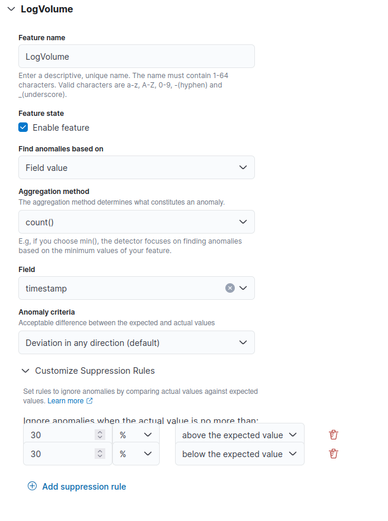
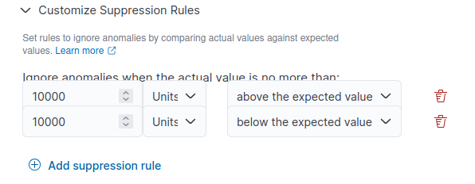

<!---  
Copyright (c) 2025 floragunn GmH

This file contains content originally licensed under Apache-2.0.
Original license header and notices preserved below.

Additional modifications by floragunn GmbH, 2025.
Modifications Copyright floragunn GmbH

---

SPDX-License-Identifier: Apache-2.0
http://www.apache.org/licenses/LICENSE-2.0

The OpenSearch Contributors require contributions made to
this file be licensed under the Apache-2.0 license or a
compatible open source license.

Modifications Copyright OpenSearch Contributors. See
GitHub history for details.
-->




# Search Guard Anomaly Detection

{: .no_toc}



An _anomaly_ in Search Guard is any unusual behavior change in your time-series data. Anomalies can provide valuable insights into your data. For example, for IT infrastructure data, an anomaly in the memory usage metric can help identify early signs of a system failure.

Conventional techniques like visualizations and dashboards can make it difficult to uncover anomalies. Configuring alerts based on static thresholds is possible, but this approach requires prior domain knowledge and may not adapt to data with organic growth or seasonal trends.

Anomaly detection automatically detects anomalies in your Elasticsearch data in near real time using the Random Cut Forest (RCF) algorithm. RCF is an unsupervised machine learning algorithm that models a sketch of your incoming data stream to compute an _anomaly grade_ and _confidence score_ value for each incoming data point. These values are used to differentiate an anomaly from normal variations. For more information about how RCF works, see [Robust Random Cut Forest Based Anomaly Detection on Streams](https://www.semanticscholar.org/paper/Robust-Random-Cut-Forest-Based-Anomaly-Detection-on-Guha-Mishra/ecb365ef9b67cd5540cc4c53035a6a7bd88678f9).

You can pair the Anomaly Detection plugin with [Signals Alerting](elasticsearch-alerting-getting-started) to notify you as soon as an anomaly is detected.
{: .note}

## Technical Preview Version Download

**At the moment, the technical preview of Anomaly Detection is available for Elasticsearch 8.17.0.**

- Download the technical preview of the [Anomaly Detection Elasticsearch plugin](https://maven.search-guard.com//search-guard-anomaly-detection-release/com/floragunn/search-guard-anomaly-detection/1.0.0-tp1-es-8.17.0/search-guard-anomaly-detection-1.0.0-tp1-es-8.17.0.zip)
- Download the technical preview of the [Anomaly Detection Kibana plugin](https://maven.search-guard.com/search-guard-anomaly-detection-release/com/floragunn/search-guard-kibana-anomaly-detection/1.0.0-tp1-es-8.17.0/search-guard-kibana-anomaly-detection-1.0.0-tp1-es-8.17.0.zip)
- Download the technical preview of the [Anomaly Detection scheduler plugin](https://maven.search-guard.com//search-guard-anomaly-detection-release/com/floragunn/jobscheduler/search-guard-ad-scheduler/1.0.0-tp1-es-8.17.0/search-guard-ad-scheduler-1.0.0-tp1-es-8.17.0-plugin.zip)

## Install Search Guard Anomaly Detection

Search Guard Anomaly Detection can be installed like any other Elasticsearch plugin by using the `elasticsearch-plugin` command.

It is important to install the Anomaly Detection scheduler plugin before installing the Anomaly Detection Elasticsearch plugin.
{: .note}

Change to the directory of your Elasticsearch installation and type:

```bash
bin/elasticsearch-plugin install -b file:///path/to/anomaly-detection-scheduler-plugin.zip
bin/elasticsearch-plugin install -b file:///path/to/anomaly-detection-elasticsearch-plugin.zip
```

Once this is ready, you can also install the Anomaly Detection Kibana plugin.
To do this, change to the directory of your Kibana installation and type:

```bash
bin/kibana-plugin install file:///path/to/anomaly-detection-kibana-plugin.zip
```

## Getting started with anomaly detection in Kibana

To get started, go to **Kibana** > **Search Guard** > **Anomaly Detection**.

## Step 1: Define a detector

A _detector_ is an individual anomaly detection task. You can define multiple detectors, and all detectors can run simultaneously, with each analyzing data from different sources. You can define a detector by following these steps:

1. On the **Anomaly detection** page, select the **Create detector** button.
2. On the **Define detector** page, enter the required information in the **Detector details** pane.
3. In the **Select data** pane, specify the data source by choosing a source from the **Index** dropdown menu. You can choose an index, index patterns, or an alias.
4. (Optional) Filter the data source by selecting **Add data filter** and then entering the conditions for **Field**, **Operator**, and **Value**. Alternatively, you can choose **Use query DSL** and add your JSON filter query. Only **boolean queries** are supported for query domain-specific language (DSL).

### Example: Filtering data using query DSL

The following example query retrieves documents in which the `urlPath.keyword` field matches any of the specified values. To set up the detector, use the following steps.

#### Setting the initial detector settings

1. Choose **Create detector**.
1. Add the detector details. Enter a name and brief description. Make sure the name is unique and descriptive enough to help you identify the purpose of the detector.
1. Specify the data source.
   - For **Data source**, choose one or more indexes to use as the data source. Alternatively, you can use an alias or index pattern to choose multiple indexes, similarly to the following:
     - /domain/{id}/short
     - /sub_dir/{id}/short
     - /abcd/123/{id}/xyz

   - Detectors can use remote indexes. You can access them using the `cluster-name:index-name` pattern. Alternatively, you can select clusters and indexes. To learn about configuring remote indexes with the Search Guard Security plugin enabled, see [Selecting remote indexes with fine-grained access control](anomaly-detection-security#selecting-remote-indexes-with-fine-grained-access-control) in the [Anomaly detection security](anomaly-detection-security) documentation.

   - (Optional) For **Data filter**, filter the index you chose as the data source. From the **Data filter** menu, choose **Add data filter**, and then design your filter query by selecting **Field**, **Operator**, and **Value**, or choose **Use query DSL** and add your own JSON filter query. Only **boolean queries** are supported for query DSL. The following example `bool` query shows you how to use query DSL:


To create a cross-cluster detector in Kibana, the following [permissions]({{site.url}}{{site.baseurl}}/security/access-control/permissions/) are required: `indices:data/read/field_caps`, `indices:admin/resolve/index`, and `cluster:monitor/remote/info`.
{: .note}



```json
 {
    "bool": {
       "should": [
             {
                "term": {
                   "urlPath.keyword": "/domain/{id}/short"
                }
             },
             {
                "term": {
                   "urlPath.keyword": "/sub_dir/{id}/short"
                }
             },
             {
                "term": {
                   "urlPath.keyword": "/abcd/123/{id}/xyz"
                }
             }
       ]
    }
 }
```

#### Setting the detector interval

In the **Timestamp** pane, select a field from the **Timestamp field** dropdown menu.

Then, in the **Operation settings** pane, use the following best practices to define the **Detector interval**, which is the interval at which the detector collects data:

- The detector aggregates the data at this interval and then feeds the aggregated result into the anomaly detection model. The shorter the interval, the fewer data points the detector aggregates. The anomaly detection model uses a shingling process, a technique that uses consecutive data points to create a sample for the model. This process requires a certain number of aggregated data points from contiguous intervals.
- You should set the detector interval based on your actual data. If the detector interval is too long, then it might delay the results. If the detector interval is too short, then it might miss some data. The detector interval also will not have a sufficient number of consecutive data points for the shingle process.
- (Optional) To add extra processing time for data collection, specify a **Window delay** value.
  - This value tells the detector that the data is not ingested into Elasticsearch in real time but with a certain delay. Set the window delay to shift the detector interval to account for this delay.
  - For example, the detector interval is 10 minutes and data is ingested into your cluster with a general delay of 1 minute. Assume the detector runs at 2:00. The detector attempts to get the last 10 minutes of data from 1:50 to 2:00, but because of the 1-minute delay, it only gets 9 minutes of data and misses the data from 1:59 to 2:00. Setting the window delay to 1 minute shifts the interval window to 1:49--1:59, so the detector accounts for all 10 minutes of the detector interval time.
  - To avoid missing any data, set the **Window delay** to the upper limit of the expected ingestion delay. This ensures that the detector captures all data during its interval, reducing the risk of missing relevant information. While a longer window delay helps capture all data, too long of a window delay can hinder real-time anomaly detection because the detector will look further back in time. Find a balance that maintains both data accuracy and timely detection.

#### Specifying a custom results index

The Anomaly Detection plugin allows you to store anomaly detection results in a custom index of your choice. Select **Enable custom results index** and provide a name for your index, for example, `abc`. The plugin then creates an alias prefixed with `searchguard-ad-result-` followed by your chosen name, for example, `searchguard-ad-result-abc`. This alias points to an actual index with a name containing the date and a sequence number, such as `searchguard-ad-result-abc-history-2024.06.12-000002`, where your results are stored.

You can use `-` to separate the namespace to manage custom results index permissions. For example, if you use `searchguard-ad-result-financial-us-group1` as the results index, you can create a permission role based on the pattern `searchguard-ad-result-financial-us-*` to represent the `financial` department at a granular level for the `us` group.
{: .note }

##### Permissions

When the Search Guard Security plugin (fine-grained access control) is enabled, the default results index becomes a system index and is no longer accessible through the standard Index or Search APIs. To access its content, you must use the Anomaly Detection RESTful API or the dashboard. As a result, you cannot build customized dashboards using the default results index if the Security plugin is enabled. However, you can create a custom results index in order to build customized dashboards.

If the custom index you specify does not exist, the Anomaly Detection plugin will create it when you create the detector and start your real-time or historical analysis.

If the custom index already exists, the plugin will verify that the index mapping matches the required structure for anomaly results. In this case, ensure that the custom index has a valid mapping as defined in the [`anomaly-results.json`](https://git.floragunn.com/search-guard/search-guard-anomaly-detection/-/blob/main/src/main/resources/mappings/anomaly-results.json) file.
To use the custom results index option, you must have the following permissions:

- `indices:admin/create` -- The `create` permission is required in order to create and roll over the custom index.
- `indices:admin/aliases` and `indices:admin/aliases/get` -- The `aliases` and `aliases/get` permissions are required in order to create and manage an alias for the custom index.
- `indices:data/write/index` -- The `write` permission is required in order to write results into the custom index for a single-entity detector.
- `indices:data/read/search` -- The `search` permission is required in order to search custom results indexes to show results on the Anomaly Detection interface.
- `indices:data/write/delete` -- The detector may generate many anomaly results. The `delete` permission is required in order to delete old data and save disk space.
- `indices:data/write/bulk*` -- The `bulk*` permission is required because the plugin uses the Bulk API to write results into the custom index.


##### Flattening nested fields

Custom results index mappings with nested fields pose aggregation and visualization challenges. The **Enable flattened custom result index** option flattens the nested fields in the custom results index. When selecting this option, the plugin creates a separate index prefixed with the custom results index name and detector name. For example, if the detector `Test` uses the custom results index `abc`, a separate index with the alias `searchguard-ad-result-abc-flattened-test` will store the anomaly detection results with nested fields flattened.

In addition to creating a separate index, the plugin also sets up an ingest pipeline with a script processor. This pipeline is bound to the separate index and uses a Painless script to flatten all nested fields in the custom results index.

Deactivating this option on a running detector removes its flattening ingest pipeline; it also ceases to be the default for the results index.
When using the flattened custom result option, consider the following:

- The Anomaly Detection plugin constructs the index name based on the custom results index and detector name, and because the detector name is editable, conflicts can occur. If a conflict occurs, the plugin reuses the index name.
- When managing the custom results index, consider the following:
    - The Anomaly Detection Kibana plugin queries all detector results from all custom results indexes. Having too many custom results indexes can impact the plugin's performance.
    - You can use [Automated Index Management](automated-index-management) to roll over old results indexes. You can also manually delete or archive any old results indexes. Reusing a custom results index for multiple detectors is recommended.

The plugin rolls over an alias to a new index when the custom results index meets any of the conditions in the following table.

Parameter | Description | Type | Unit | Example | Required
:--- | :--- |:--- |:--- |:--- |:---
`result_index_min_size` | The minimum total primary shard size (excluding replicas) required for index rollover. When set to 100 GiB with an index that has 5 primary and 5 replica shards of 20 GiB each, the rollover runs. | `integer` | `MB` | `51200` | No
`result_index_min_age` |  The minimum index age required for the rollover, calculated from its creation time to the current time. | `integer` |`day` | `7` | No
`result_index_ttl` | The minimum age required in order to delete rolled-over indexes. | `integer` | `day` | `60` | No


#### Next step

After defining you detector settings, choose **Next**.

After you define the detector, the next step is to configure the model.

## Step 2: Configure the model

Add features to your detector. A _feature_ is an aggregation of a field or a Painless script. A detector can discover anomalies across one or more features.

You must choose an aggregation method for each feature: `average()`, `count()`, `sum()`, `min()`, or `max()`. The aggregation method determines what constitutes an anomaly. For example, if you choose `min()`, the detector focuses on finding anomalies based on the minimum values of your feature. If you choose `average()`, the detector finds anomalies based on the average values of your feature.

You can also use [custom JSON aggregation queries](#configuring-a-model-based-on-a-json-aggregation-query) as an aggregation method. 


For each configured feature, you can also select the anomaly criteria. By default, the model detects an anomaly when the actual value is either abnormally higher or lower than the expected value. However, you can customize your feature settings so that anomalies are only registered when the actual value is higher than the expected value (indicating a spike in the data) or lower than the expected value (indicating a dip in the data). For example, when creating a detector for the `cpu_utilization` field, you may choose to register anomalies only when the value spikes in order to reduce alert fatigue.


### Suppressing anomalies with threshold-based rules

In the **Feature selection** pane, you can suppress anomalies by setting rules that define acceptable differences between the expected and actual values, either as an absolute value or a relative percentage. This helps reduce false anomalies caused by minor fluctuations, allowing you to focus on significant deviations.

To suppress anomalies for deviations of less than 30% from the expected value, you can set the following rules in the feature selection pane:

- Ignore anomalies when the actual value is no more than 30% above the expected value.
- Ignore anomalies when the actual value is no more than 30% below the expected value.

The following image shows the pane for a feature named `LogVolume`, where you can set the relative deviation percentage settings:



If you expect that the log volume should differ by at least 10,000 from the expected value before being considered an anomaly, you can set the following absolute thresholds:

- Ignore anomalies when the actual value is no more than 10,000 above the expected value.
- Ignore anomalies when the actual value is no more than 10,000 below the expected value.

The following image shows the pane for a feature named `LogVolume`, where you can set the absolute threshold settings:




If no custom suppression rules are set, then the system defaults to a filter that ignores anomalies with deviations of less than 20% from the expected value for each enabled feature.

A multi-feature model correlates anomalies across all of its features. The [curse of dimensionality](https://en.wikipedia.org/wiki/Curse_of_dimensionality) makes it less likely that a multi-feature model will identify smaller anomalies as compared to a single-feature model. Adding more features can negatively impact the [precision and recall](https://en.wikipedia.org/wiki/Precision_and_recall) of a model. A higher proportion of noise in your data can further amplify this negative impact. To select the optimal feature set limit for anomalies, we recommend an iterative process of testing different limits. By default, the maximum number of features for a detector is `5`. To adjust this limit, use the `anomaly_detection.max_anomaly_features` setting.
{: .note}


### Configuring a model based on an aggregation method

To configure an anomaly detection model based on an aggregation method, follow these steps:

1. On the **Detectors** page, select the desired detector from the list.
2. On the detector's details page, select the **Actions** button to activate the dropdown menu and then select **Edit model configuration**.
3. On the **Edit model configuration** page, select the **Add another feature** button.
4. Enter a name in the **Feature name** field and select the **Enable feature** checkbox.
5. Select **Field value** from the dropdown menu under **Find anomalies based on**.
6. Select the desired aggregation from the dropdown menu under **Aggregation method**.
7. Select the desired field from the options listed in the dropdown menu under **Field**.
8. Select the **Save changes** button.

### Configuring a model based on a JSON aggregation query

To configure an anomaly detection model based on a JSON aggregation query, follow these steps:

1. On the **Edit model configuration** page, select the **Add another feature** button.
2. Enter a name in the **Feature name** field and select the **Enable feature** checkbox.
3. Select **Custom expression** from the dropdown menu under **Find anomalies based on**. The JSON editor window will open.
4. Enter your JSON aggregation query in the editor.
5. Select the **Save changes** button.

For acceptable JSON query syntax, please check Elasticsearch's Query DSL.
{: .note}

### Setting categorical fields for high cardinality

You can categorize anomalies based on a keyword or IP field type. You can enable the **Categorical fields** option to categorize, or "slice," the source time series using a dimension, such as an IP address, a product ID, or a country code. This gives you a granular view of anomalies within each entity of the category field to help isolate and debug issues.

To set a category field, choose **Enable categorical fields** and select a field. You cannot change the category fields after you create the detector.

Only a certain number of unique entities are supported in the category field. Use the following equation to calculate the recommended total number of entities supported in a cluster:

```
(data nodes * heap size * anomaly detection maximum memory percentage) / (entity model size of a detector)
```

To get the detector's entity model size, use the [Profile Detector API](anomaly-detection-api#profile-detector). You can adjust the maximum memory percentage using the `anomaly_detection.model_max_size_percent` setting.

Consider a cluster with 3 data nodes, each with 8 GB of JVM heap size and the default 10% memory allocation. With an entity model size of 1 MB, the following formula calculates the estimated number of unique entities:

```
(8096 MB * 0.1 / 1 MB ) * 3 = 2429
```

If the actual total number of unique entities is higher than the number that you calculate (in this case, 2,429), then the anomaly detector attempts to model the extra entities. The detector prioritizes both entities that occur more often and are more recent.

This formula serves as a starting point. Make sure to test it with a representative workload.
{: .note }

### Setting a shingle size

In the **Advanced settings** pane, you can set the number of data stream aggregation intervals to include in the detection window. Choose this value based on your actual data to find the optimal setting for your use case. To set the shingle size, select **Show** in the **Advanced settings** pane. Enter the desired size in the **intervals** field.

The anomaly detector requires the shingle size to be between 1 and 128. The default is `8`. Use `1` only if you have at least two features. Values of less than `8` may increase [recall](https://en.wikipedia.org/wiki/Precision_and_recall) but also may increase false positives. Values greater than `8` may be useful for ignoring noise in a signal.

### Setting an imputation option

In the **Advanced settings** pane, you can set the imputation option. This allows you to manage missing data in your streams. The options include the following:

- **Ignore Missing Data (Default):** The system continues without considering missing data points, keeping the existing data flow.
- **Fill with Custom Values:** Specify a custom value for each feature to replace missing data points, allowing for targeted imputation tailored to your data.
- **Fill with Zeros:** Replace missing values with zeros. This is ideal when the absence of data indicates a significant event, such as a drop to zero in event counts.
- **Use Previous Values:** Fill gaps with the last observed value to maintain continuity in your time-series data. This method treats missing data as non-anomalous, carrying forward the previous trend.

Using these options can improve recall in anomaly detection. For instance, if you are monitoring for drops in event counts, including both partial and complete drops, then filling missing values with zeros helps detect significant data absences, improving detection recall.

Be cautious when imputing extensively missing data, as excessive gaps can compromise model accuracy. Quality input is critical---poor data quality leads to poor model performance. The confidence score also decreases when imputations occur. You can check whether a feature value has been imputed using the `feature_imputed` field in the anomaly results index. See [Anomaly result mapping](anomaly-detection-result-mapping) for more information.
{: note}


### Previewing sample anomalies

You can preview anomalies based on sample feature input and adjust the feature settings as needed. The Anomaly Detection plugin selects a small number of data samples---for example, 1 data point every 30 minutes---and uses interpolation to estimate the remaining data points to approximate the actual feature data. The sample dataset is loaded into the detector, which then uses the sample dataset to generate a preview of the anomalies.

1. Choose **Preview sample anomalies**.
  - If sample anomaly results are not displayed, check the detector interval to verify that 400 or more data points are set for the entities during the preview date range.
2. Select the **Next** button.

## Step 3: Setting up detector jobs

To start a detector to find anomalies in your data in near real time, select **Start real-time detector automatically (recommended)**.

Alternatively, if you want to perform historical analysis and find patterns in longer historical data windows (weeks or months), select the **Run historical analysis detection** box and select a date range of at least 128 detection intervals.

Analyzing historical data can help to familiarize you with the Anomaly Detection plugin. For example, you can evaluate the performance of a detector against historical data in order to fine-tune it.

You can experiment with historical analysis by using different feature sets and checking the precision before using real-time detectors.

## Step 4: Reviewing detector settings

Review your detector settings and model configurations to confirm that they are valid and then select **Create detector**.

If a validation error occurs, edit the settings to correct the error and return to the detector page.
{: .note }

## Step 5: Observing the results

Choose either the **Real-time results** or **Historical analysis** tab. For real-time results, it will take some time to display the anomaly results. For example, if the detector interval is 10 minutes, then the detector may take an hour to initiate because it is waiting for sufficient data to be able to generate anomalies.

A shorter interval results in the model passing the shingle process more quickly and generating anomaly results sooner. You can use the [profile detector](anomaly-detection-api#profile-detector) operation to ensure that you have enough data points.

If the detector is pending in "initialization" for longer than 1 day, aggregate your existing data and use the detector interval to check for any missing data points. If you find many missing data points, consider increasing the detector interval.

Click and drag over the anomaly line chart to zoom in and see a detailed view of an anomaly.
{: .note }

You can analyze anomalies using the following visualizations:

- **Live anomalies** (for real-time results) displays live anomaly results for the last 60 intervals. For example, if the interval is `10`, it shows results for the last 600 minutes. The chart refreshes every 30 seconds.
- **Anomaly overview** (for real-time results) or **Anomaly history** (for historical analysis on the **Historical analysis** tab) plot the anomaly grade with the corresponding measure of confidence. The pane includes:
  - The number of anomaly occurrences based on the given data-time range.
  - The **Average anomaly grade**, a number between 0 and 1 that indicates how anomalous a data point is. An anomaly grade of `0` represents "not an anomaly," and a non-zero value represents the relative severity of the anomaly.
  - **Confidence** estimate of the probability that the reported anomaly grade matches the expected anomaly grade. Confidence increases as the model observes more data and learns the data behavior and trends. Note that confidence is distinct from model accuracy.
  - **Last anomaly occurrence** is the time at which the last anomaly occurred.

Underneath **Anomaly overview** or **Anomaly history** are:

- **Feature breakdown** plots the features based on the aggregation method. You can vary the date-time range of the detector. Selecting a point on the feature line chart shows the **Feature output**, the number of times a field appears in your index, and the **Expected value**, a predicted value for the feature output. Where there is no anomaly, the output and expected values are equal.

- **Anomaly occurrences** shows the `Start time`, `End time`, `Data confidence`, and `Anomaly grade` for each detected anomaly.

Selecting a point on the anomaly line chart shows **Feature Contribution**, the percentage of a feature that contributes to the anomaly

If you set the category field, you see an additional **Heat map** chart. The heat map correlates results for anomalous entities. This chart is empty until you select an anomalous entity. You also see the anomaly and feature line chart for the time period of the anomaly (`anomaly_grade` > 0).


If you have set multiple category fields, you can select a subset of fields to filter and sort the fields by. Selecting a subset of fields lets you see the top values of one field that share a common value with another field.

For example, if you have a detector with the category fields `ip` and `endpoint`, you can select `endpoint` in the **View by** dropdown menu. Then select a specific cell to overlay the top 20 values of `ip` on the charts. The Anomaly Detection plugin selects the top `ip` by default. You can see a maximum of 5 individual time-series values at the same time.

## Step 6: Set up alerts

You can configure a watch to notify you when anomalies are detected. For steps to create a watch and set up notifications based on your anomaly detector, see [Signals Alerting](elasticsearch-alerting-getting-started).

If you stop or delete a detector, make sure to delete any watches associated with it.

## Step 7: Adjust the model

To see all the configuration settings for a detector, choose the **Detector configuration** tab.

1. To make any changes to the detector configuration, or fine tune the time interval to minimize any false positives, go to the **Detector configuration** section and choose **Edit**.
- You need to stop real-time and historical analysis to change its configuration. Confirm that you want to stop the detector and proceed.
2. To enable or disable features, in the **Features** section, choose **Edit** and adjust the feature settings as needed. After you make your changes, choose **Save and start detector**.

## Step 8: Manage your detectors

To start, stop, or delete a detector, go to the **Detectors** page.

1. Choose the detector name.
2. Choose **Actions** and select **Start real-time detectors**, **Stop real-time detectors**, or **Delete detectors**.
