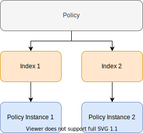

<!--- Copyright 2020 floragunn GmbH -->

# Getting started with Automated Index Management
{: .no_toc}



In every elasticsearch cluster indices have to be managed. Normally you would perform index rollovers, deletions and snapshots manually using the elasticsearch API or by writing a script that uses the API. That takes a lot of afford that can be saved using Automated Index Management. With Automated Index Management you can automate many tasks like deleting an index after a certain amount of time or rolling an index over if it gets too large.

## Using Automated Index Management

Automated Index Management is part of the Search Guard Suite and activated by default. In order to use Automated Index Management you just need to install Search Guard.
However if you want to disable Automated Index Management just add the following setting to your `elasticsearch.yml`:

```yml
aim.enabled: false
```

## Concepts

Automated Index Management uses policies to define index life cycles. Once a policy is created it can be mapped to indices. Automated Index Management then detects these indices and creates a policy instance for each one. A policy can be mapped to multiple indices. However only one policy instance exists for every managed index.



### Policies

Before you can start automating index life cycles you need to create a policy that defines the lifecycle. These policies then can be mapped to indices. Every policy has a unique name and consist of at least one state.

You can create policies using the [PUT policy API](rest_api_policy.md).

### Index settings

Once a policy is created you can use that policy on index templates or single indices. Just add the following settings to the index template or the indices you want to manage with that policy.

```JSON
"index.aim.policy_name":"my_policy_name"
```

> **Note:** If you are using the rollover action in your policy you also need to configure a rollover alias inside the index settings:

```JSON
"index.aim.rollover_alias":"my_rollover_alias"
```

### Policy instances

If an index is created that defines a policy in it's index settings an internal policy instance is created automatically. This policy instance acts as a runner for this specific index and gets executed at a fixed rate (default is every 5mins). On each run all conditions get checked and if one of them is met also the actions get executed.
