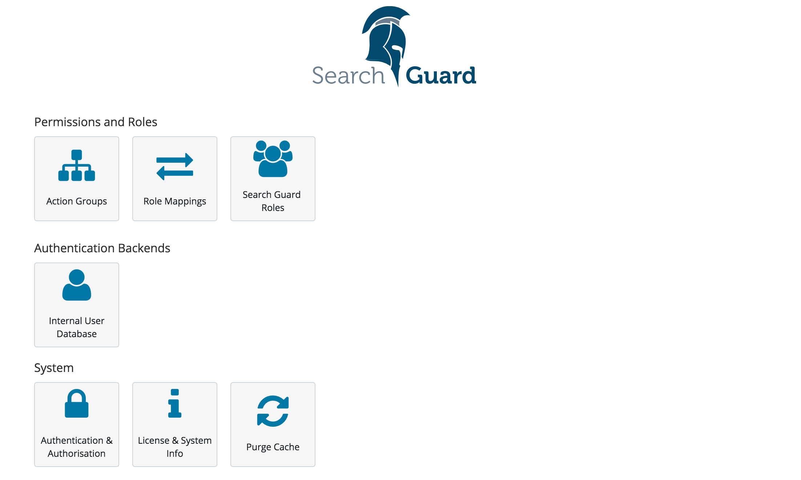
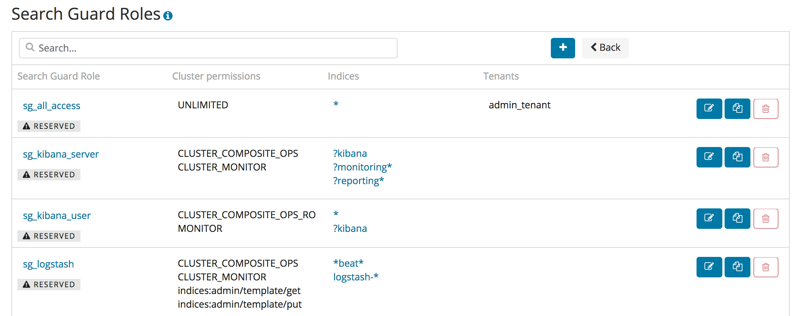
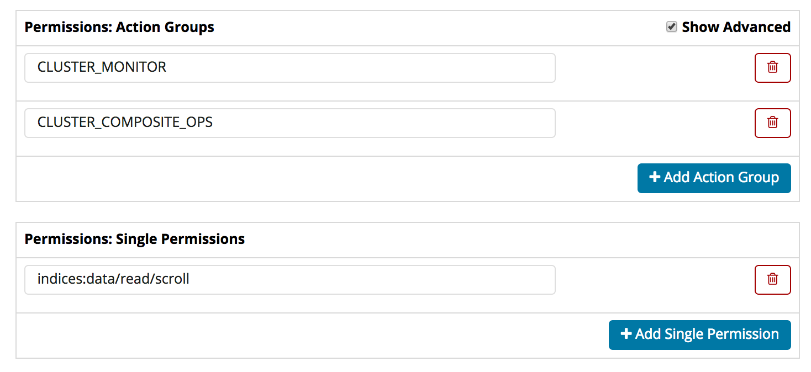
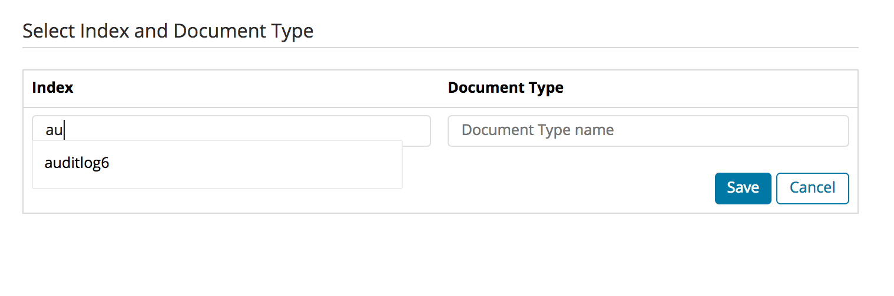
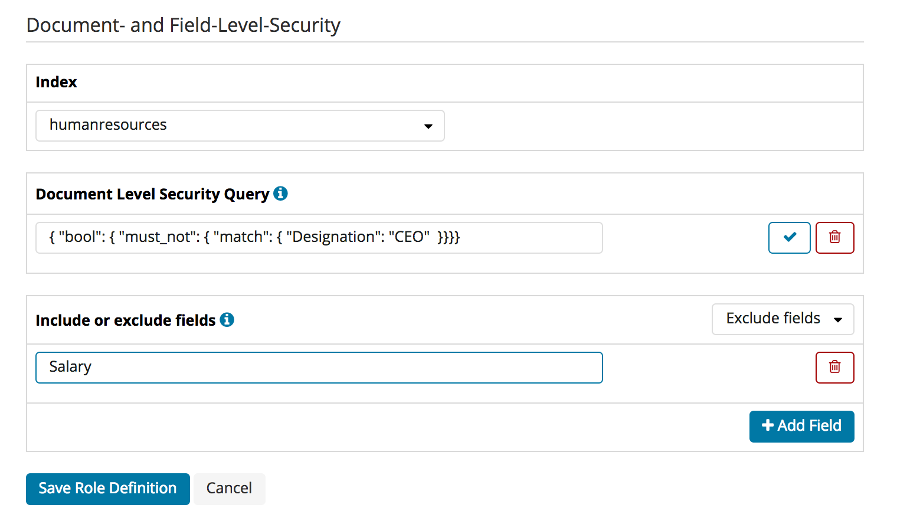
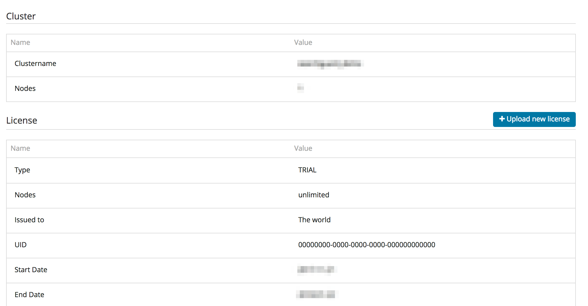

<!---
Copyright 2022 floragunn GmbH
-->

# Using the Search Guard configuration GUI
{: .no_toc}



The Search Guard configuration GUI provides an intuitive way to manage users, roles and permissions, the Search Guard system status and the Search Guard license.

The configuration GUI is part of the [Search Guard Kibana plugin](../_docs_kibana/kibana_installation.md) and installed by default.

It uses the Search Guard [REST management API](../_docs_rest_api/restapi_api_access.md) under the hood, and detects automatically if this module is installed and if the current user has access to the API. In other words, there is nothing to configure in kibana.yml to use the GUI.

The configuration GUI is an Enterprise feature and not available in the Community Edition.
{: .note .js-note .note-warning}

## Access control

The plugin automatically detects if a user has access to the REST API or not. All Search Guard roles that should have access must be configured in `elasticsearch.yml` with the following key:

```
searchguard.restapi.roles_enabled: ["SGS_ALL_ACCESS", ...]
```

If you have [restricted certain endpoints](../_docs_rest_api/restapi_api_access.md) for the currently logged in user, the plugin will automatically disable these features.

For everything to work, the logged in user should have:

* Access to the `ACTIONGROUPS` endpoint with `GET` method
 * Otherwise, autocompletion of action groups will not work
* the permission `indices:admin/validate/query` on all indices
 * Otherwise, the syntax check for DLS queries will not work

## Main menu

If you log in with a user that has access to the GUI, you will see a new navigation entry called "Search Guard" in the left navigation pane.

<p align="center">

</p>


If you click on it you will be taken to the main navigation screen.

<p align="center">

</p>

To edit user, roles and permissions click on:

* Action Groups: Edit action groups
* Roles Mappings: Map users, backend roles and hostnames to Search Guard roles
* Roles: Manage Search Guard roles, permissions, DLS/FLS and tenants
* Internal User Database: Add end edit users stored in the Internal User Database authentication backend

For managing Search Guard:

* Authentication & Authorization: Display the currently configured authentication and authorization modules and their settings
* License & System Info: Display the system status and the loaded modules, display and upload Search Guard licenses
* Purge Cache: Purge all Search Guard internal caches

## Listing Resources

If you click on any of the resources menu items, you will see a screen which lists all resources with additional infos. For example, the "Search Guard Roles" listing will display the cluster permissions, any indices with configured permissions and the tenants for each role.

<p align="center">

</p>

You can filter the list of resources and add a new resource by using the controls on the top of the table:

<p align="center">

</p>

For each resource, you can decide to edit, clone or delete it by using the controls on the right:

<p align="center">

</p>


## Reserved Resources

If a resource is reserved, it is marked underneath the resource name. You cannot edit or delete reserved resources. 

<p align="center">

</p>


If you want to mark or unmark a resource, you need to change the readonly flag in the respective configuration YAML file and upload the changes via `sgctl`. Example:

```
sg_kibana_server:
  readonly: false
  ...
```

### Cloning Resources

If you want to copy any resource, including reserved resources, you can always use the "Clone" button.

## Editing Resources

Depending on the type of resource, the edit screens will look slightly different. Most settings are self-explanatory. 

### Permissions dialogue

With the permissions dialogue you can edit permissions for:

* Roles on cluster-level
* Roles on index level
* Action Groups

The recommended way to manage permissions is to use the built-in action groups that ship with Search Guard. If you want to edit permissions on a more fine-grained level, you can click on the "Advanced" checkbox will will let you edit single permissions.

<p align="center">

</p>

### Index- and Document-Type Permissions

To edit index-level permissions, you need to first select the index and the document type you want to edit permissions for. You can then so so in the permissions dialogue displayed below.

<p align="center">

</p>

### Index- and Document-Type Permissions

If you want to add new index- and document-type permissions, click on the "Add new index and document Type" button. You need to enter and save the indexname and document-type name before you can configure the permissions.

<p align="center">

</p>

### Document- and Field-Level-Security

You can configure Document- and Field-Level-Security for each role and index separately. First, select the index you want to edit. 

You can then enter the Document-Level security in the text field under "Document Level Security Query". Clicking on the tick symbol will validate the query syntactically.

For Fiel-Level-Security you can list the fields, and specify if they should be included (white-listed) or excluded (black-listed).

<p align="center">

</p>

### Tenants

The "Tenants" tab on the edit roles screen allows you to add and remove tenants for any role. You can define whether the role should have read/write access or read-only access to the tenant:

<p align="center">

</p>


## License & System Status

The License & System Status displays the deployed Search Guard license, and also information about the loaded Search Guard modules and its version number.

By clicking on "Upload license" you can upload an Enterprise License to your cluster.

<p align="center">

</p>

## Purging the Cache

The "Purge Cache" button will purge all Search Guard internal caches on all nodes.