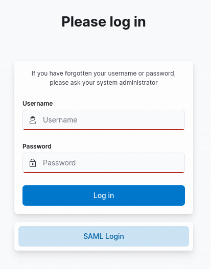

<!---
Copyright 2020 floragunn GmbH
-->

# Using Multiple Authentication Methods for Kibana

In some cases you might need to offer more than one authentication method to the users which access your Kibana installation.

There are two approaches to this:

* Search Guard displays a list of available authentication methods on the login page. The user can then choose the appropriate login method.
* You run several Kibana instances, each configured with a different login method. Users which open the URL of the respective Kibana instance in their browser, will be automatically presented with the configured login method.

## Several Authentication Methods in one Kibana Instance

Configuring more than one authentication method for Kibana is straight forward: The  `sg_frontend_config.yml` configuration allows to configure more than one login method at once. 

This might then look like this:

```yaml
default:
  auth_domains:
  - type: basic
  - type: saml
    label: "SAML Login"
    idp.metadata_url: "http://your.idp/auth/realms/master/protocol/saml/descriptor"
    idp.entity_id: "IdP entity id from the IdP"
    sp.entity_id: "SP entity id from the IdP"
    roles_key: "roles"    
```

The resulting login screen will then look like this:



You can also configure several `auth_domains` entries using the same type. So, you can support several IdPs at once. Use the `label` attribute of each entry to give the user a short hint what authentication method is configured here. The value of the `label` attribute will be displayed on the button that links to the IdP.

## Running Several Kibana Instances

If you are running several instances of Kibana, you can assign each Kibana instance a different authentication configuration. 

To achieve this, the `sg_frontend_authc.yml` configuration file allows you to specify additional configuration entries, besides the usually existing `default` entry.

So, you can have your `sg_frontend_authc.yml` like this:

```yaml
default:
  auth_domains:
  - type: basic
another_instance:
  auth_domains:  
  - type: saml
    idp.metadata_url: "http://your.idp/auth/realms/master/protocol/saml/descriptor"
    idp.entity_id: "IdP entity id from the IdP"
    sp.entity_id: "SP entity id from the IdP"
    roles_key: "roles"    
```

On the Kibana instance, which is supposed to use SAML authentication, edit the file `config/kibana.yml` and add this line:

```yaml
searchguard.sg_frontend_config_id: another_instance
```

This makes the Kibana instance use the configuration entry `another_instance` in  `sg_frontend_config.yml`.

In order to activate the changes, do not forget to upload `sg_frontend_config.yml` and restart the particular Kibana instance afterwards. 

