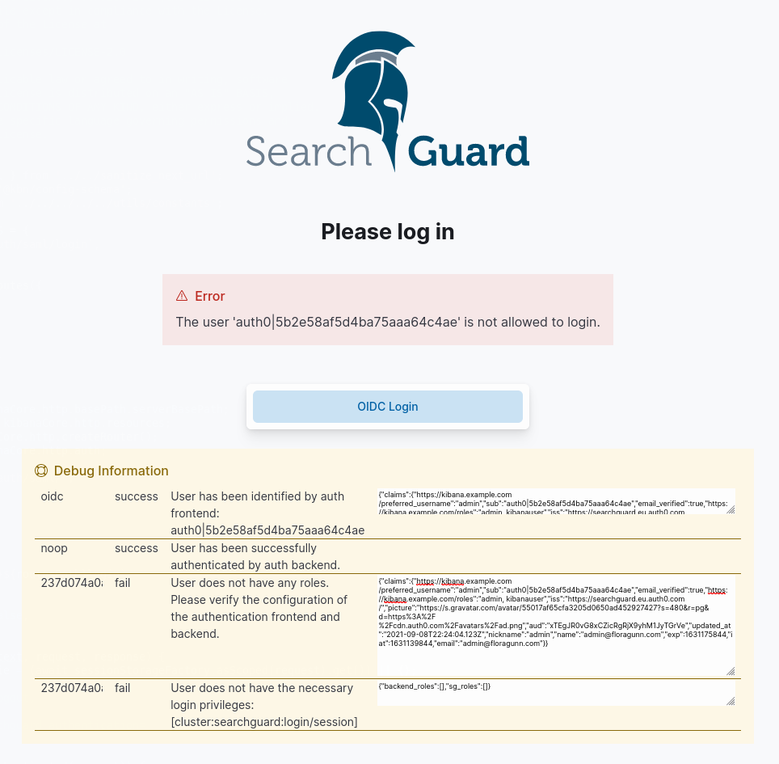

<!---
Copyright 2020 floragunn GmbH
-->

# Dashboards/Kibana Authentication Troubleshooting
{: .no_toc}

In case you encounter problems with authentication in Dashboards/Kibana, you can use a special configuration option to display useful debugging information while logging in.

To do so, edit `sg_config.yml` and add `debug: true` in the `dynamic` section:

```yaml
sg_config:
  dynamic:
    debug: true
    # ...
```

**Important:** Be aware that this might expose sensitive information to all users which can access the cluster. Don't use this on production clusters.

After having activated the configuration with `sgadmin` or `sgctl`, open Dashboards/Kibana in your browser and try to log in. If you encounter a login failure, you should see more detailed information about the login process. This can look like this:





