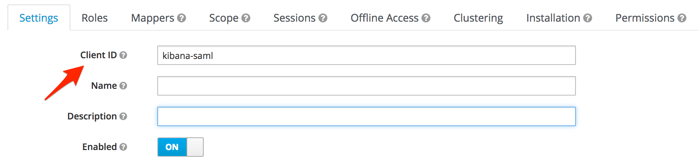
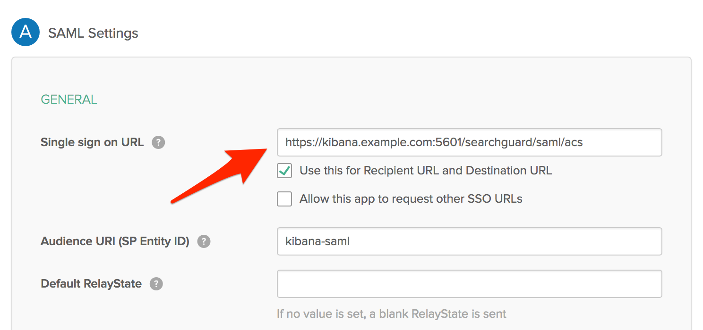
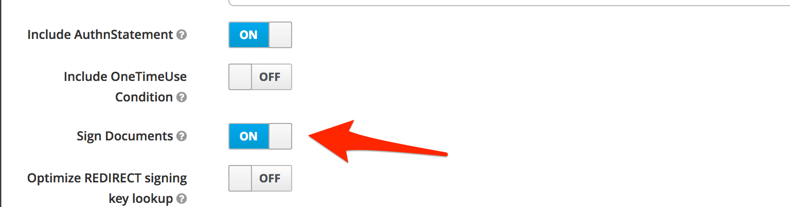
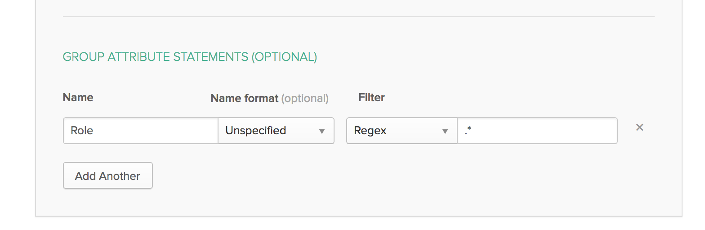

<!--- Copyright 2022 floragunn GmbH -->

# SAML troubleshooting

If you encounter any problems while using SAML, please check the following steps to pinpoint the problem. 

## Check the sp.entity_id

Most IdPs allow you to configure multiple authentication methods for different client applications. For example, in Okta these are called "Applications", in Keycloak they are called "Clients". Each of these applications has their entity ID. Make sure to configure the `sp.entity_id` to match your settings.

Keycloak example:

<p align="center">

</p>

Okta example: 

<p align="center">

</p>

Search Guard configuration in `sg_frontend_authc.yml`:

```
default:
  auth_domains:
  - type: saml
    saml.sp.entity_id: "kibana-saml"
```
                    
## Check the SAML Assertion Consumer Service URL

After a successful login, your IdP sends a SAML Response via HTTP POST to the so-called "Assertion Consumer Service URL" of Kibana.

The endpoint Search Guard Kibana plugin provides is:

```
/searchguard/saml/acs
```

Make sure that you have configured this endpoint correctly in your IdP. Some IdPs also require you to whitelist all endpoints it will send requests to. Make sure the ACS endpoint is listed.

Okta example: 

<p align="center">

</p>

Kibana also requires you to whitelist this endpoint. Make sure you have the following entry in your `kibana.yml`:

```
server.xsrf.allowlist: [/searchguard/saml/acs]
```

## Make sure all documents are signed

Some IdPs do not sign the SAML documents by default. Make sure the IdP signs all documents.

Keycloak example:

<p align="center">

</p>

## Role settings

How to include user roles in the SAML response is highly dependent on the IdP. For example, in Keycloak this is configured in the Mappers section of your client. With Okta you have to set group attribute statements. Make sure this is configured correctly, and the role_key in the SAML configuration matches the role name in the SAML response.

Keycloak example:

<p align="center">

</p>

Okta example:

<p align="center">

</p>

Search Guard configuration in `sg_frontend_authc.yml`:

```
default:
  auth_domains:
  - type: saml
    user_mapping.roles.from_comma_separated_string: saml_response.Roles
```
