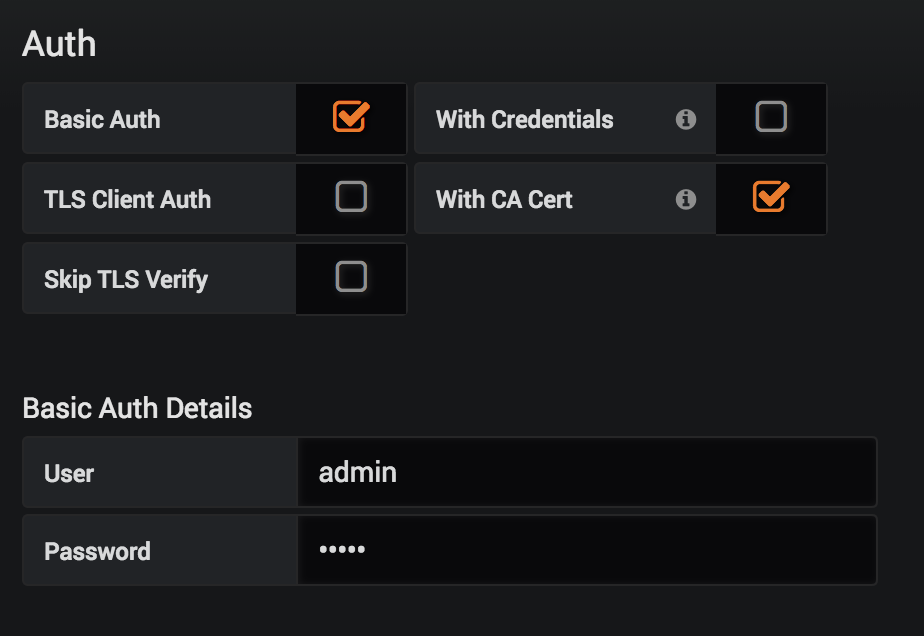
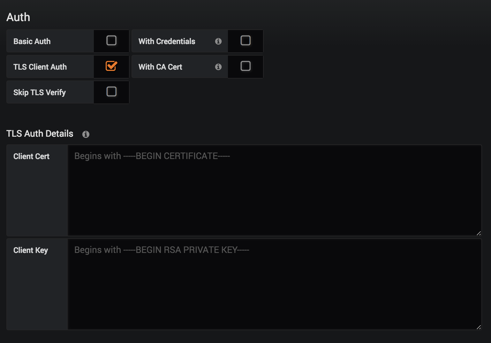

<!---
Copyright floragunn GmbH
-->

# Using Grafana with Search Guard
{: .no_toc}



Grafana connects to Elasticsearch on the REST layer, just like a browser or curl. To use Grafana with a Search Guard secured cluster:

* set up one or more Grafana users with permissions to read data
  * With the Community Edition of Grafana, you are limited to one user per datasource
  * Thus, it is not possible to use the credentials of the currently logged in user for authentication
  * See: [https://github.com/grafana/grafana/issues/6359](https://github.com/grafana/grafana/issues/6359)
* configure Grafana to use HTTPS instead of HTTP (optional, only applicable if you enabled HTTPS on the REST layer)
* import your root CA into Grafana in case you use self-signed certificates
* configure Grafana to provide credentials when connecting to Elasticsearch / Search Guard. Grafana supports
  * HTTP Basic Authentication
  * TLS client certificate authentication 

## Configure HTTPS connections

If you are using HTTPS instead of HTTP, specify a https URL when creating an Elasticsearch data source.

## Configure authentication

Grafana supports HTTP Basic Authentication and TLS client certificate authentication.

### HTTP Basic Authentication

For Basic Authentication, tick the "Basic Auth" checkbox and provide the username and password of the user for this data soure:

### TLS client certificate authentication

If you want to use TLS client authentication, tick the "TLS Client Auth" checkbox and provide the client certificate and private key:

## Configure the root CA

If you use self-signed certificates you can either disable certificate validation by ticking "Skip TLS verify". This is however insecure and thus not recommended. Rather, tick the "With CA Cert" checkbox and copy the contents of your root CA:

