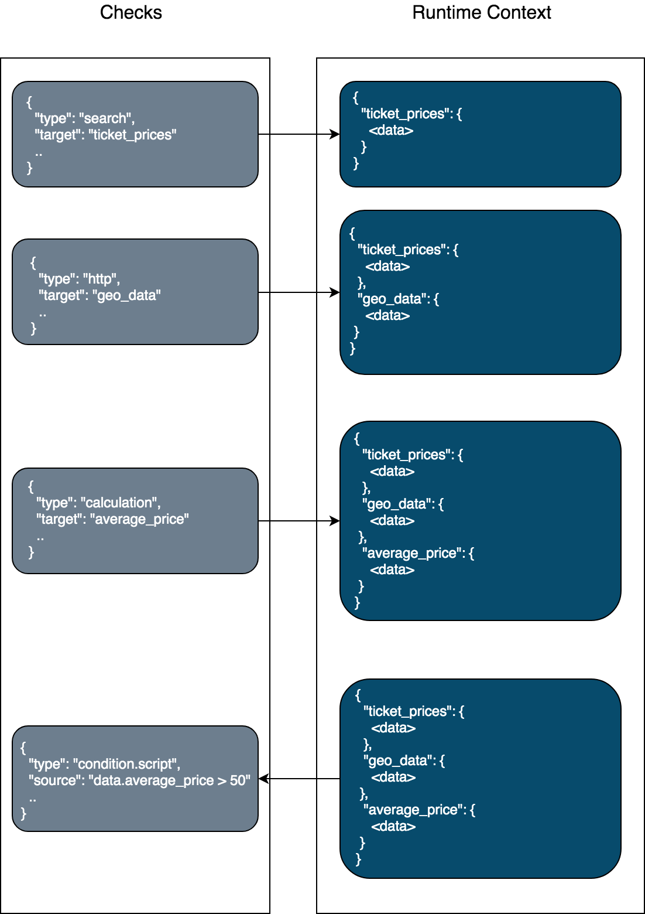

<!--- Copyright 2020 floragunn GmbH -->

# Execution chain and execution runtime data
{: .no_toc}



## Execution chain: Checks

Each watch can define as many inputs, transformations, calculations and conditions as required, in any order.

Each step in the execution chain is called a *check*. Example:

```
{
  "trigger": { ...},
  "checks": [
    {
      "type": "static",
      "name": "constants",
      ...
    },
    {
      "type": "search",
      "name": "avg_ticket_price",
      ...
    },
    {
      "type": "condition.script",
      "name": "low_price"
      ...
    },
    {
      "type": "transform",
      "name": "format_data"
      ...
    },
    {
      "type": "http",
      "name": "add_geo_data"
      ...
    },
    ...    
  ],
  "actions": [ ... ]
}
```

## Execution runtime data

All checks and actions operate on the watch runtime data.

[Input](inputs.md) checks can add data to the context; either under a specific property name or at the top level, replacing all data that was possibly stored before.

[Transformations](transformations_transformations.md) transform existing data, [Calculations](transformations_calculations.md) add data based on existing data, and [Conditions](conditions.md) control the execution flow based on the runtime data.

[Actions](actions.md) send out notifications based on the runtime data, or store all or parts of the runtime data on a data sink, like Elasticsearch.

<p align="center">

</p>

### Adding data to the runtime data

[Inputs](inputs.md) and [Transformations](transformations_transformations.md) fetch data and place it in the runtime data under a name specified by the `target` of the check. Example:

```
{
  "trigger": { ...},
  "checks": [
    {
      "type": "search",
      "name": "avg_ticket_price",
      "target": "avg_ticket_price",
      "request": {
        "indices": [
          "kibana_sample_data_flights"
        ],
        "body": {
         "query": { ... }
        }
    }
    ...    
  ],
  "actions": [ ... ]
}
```

This input executes an Elasticsearch query and stores the result of the query under the name `avg_ticket_price`. Using the special target name `_top` places the data at the top level of the runtime data. Any data that was present before gets erased.

### Accessing runtime data

Transformations, calculations and conditions access runtime data by using the prefix `data` followed by the respective property name. The property name is, of course, defined by the target value used in the input before.

```
{
  "trigger": { ...},
  "checks": [
    {
      "type": "condition.script",
      "name": "low_price",
      "source": "data.avg_ticket_price.aggregations.when.value < data.constants.ticket_price"
    }
    ...    
  ],
  "actions": [ ... ]
}
```

Format:

```
data.<target name>.path.to.data
```

### Accessing data in Mustache templates

Actions format their messages by using Mustache templates. Mustache templates have access to the runtime data as well. Example:

<!--  -->
```
{
  "trigger": { ...},
  "checks": [ ... ],
  "actions": [
      {
      "type": "webhook",
      "name": "myslack",
      "throttle_period": "1s",
      "request": {
        "method": "POST",
        "url": "https://hooks.slack.com/services/token",
        "body": "{\"text\": \"Average flight ticket price decreased to {{data.avg_ticket_price.aggregations.when.value}} over last {{data.constants.window}}\"}",
        "headers": {
          "Content-type": "application/json"
        }
      }
    }  
  ]
}
```
<!--  -->

Format:

<!--  -->
```
{{data.<target name>.path.to.data}}
```
<!--  -->
