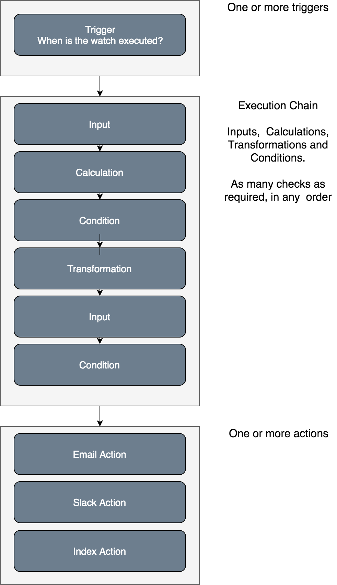

<!--- Copyright 2020 floragunn GmbH -->

# How Signals Alerting works
{: .no_toc}



Signals can be used to create and execute watches that:

* load data from different sources into a watch execution context
* perform calculations on the loaded data
* check whether conditions are met based on the loaded data
* execute one or more actions if the condition is met


## Log file analysis example

Assume you are ingesting log files from production systems to Elasticsearch. The most typical use case is to use Signals to detect an unusual amount of errors.

You can use Signals to:

* run an aggregation periodically on the logs index that counts the number of errors in the last 5 minutes
* implement a condition that checks whether the error level is above a certain threshold
* if the condition is met, send out notifications via Email or Slack to inform your DevOps team.

## Audit logging example

Assume you use the [Search Guard audit log feature](audit-logging-compliance) and want to be able to detect brute-force attempts to your cluster.

You can use Signals to

* run an aggregation periodically on the auditlog index that looks for documents where the category is FAILED\_LOGIN\_ATTEMPTS
* aggregate the documents by username and count the failed login attempts
* retain all aggregations where the number of login attempts in the last 30 minutes is above a certain threshold
* Enrich the remaining aggregations by pulling in Geoinformation from a REST API
* send out an email and/or Slack notification
* send an addition escalation email if the issue persists for more than 1 hour

## Building blocks of a Signals watch

After a watch has been *triggered*, it *checks* for specific conditions and takes *action* if necessary.

These three elements also form the three major building blocks of a Signals watch:

* **[Triggers](triggers.md)** define when a watch will be executed. Each watch should have at least one trigger
* **Checks** are constructs meant for analyzing the situation to be watched. For doing so, Signals offers
  * *[Inputs](inputs.md)* which pull in data from a source such as an Elasticsearch index or an HTTP service;
  * *[Conditions](conditions.md)* to analyze the gathered data using scripts and decide whether to proceed with execution or to abort;
  * *[Transformations and calculations](transformations_overview.md)* to transform the gathered data into a format that subsequent operations may require.
  * Each watch can have several checks, which are executed as a chain. Each action of a watch can also have a chain of checks.
* **[Actions](actions.md)** are executed if all preceding conditions are met.
  * Actions can be used to alert users via [Email](actions_email.md), [Slack](actions_slack.md) or [PagerDuty](actions_pagerduty.md).
  * Actions can be used to write the runtime data back to data sinks like an [Elasticsearch index](actions_index.md).
  * Using the [Webhook action](actions_webhook.md), it is possible to invoke any HTTP service as a result of a Signals watch.
  * Each watch can have several actions. Action-specific checks can be used to decide which actions are executed in which situation.

Optionally, you can use a **[Severity Mapping](severity.md)** in order to map the data gathered by the checks to a simple severity scale (consisting of the levels info, warning, error, critical). If you do so, you can configure actions to be executed only for specific severity levels. This can greatly simplify the definition of conditions for actions if you are modeling escalation schemes or similar structures.
Using a severity mapping also enables you to define **Resolve Actions**. These actions can be used to trigger notifications in case the severity determined by a watch decreases - or in other words - the watch finds that a previously discovered situation does not exist any more.  

The Signals dashboard also displays the current severity levels determined by the configured watches. Opposed to watches without a severity mapping, this gives you a clearer and quicker way to see what is happening right now.

## Watch Runtime Data
All watches operate on the so-called watch runtime data. Inputs put the gathered data into the runtime data; conditions can read it and transforms can modify it. Actions read from the runtime data as well.

The runtime data is formed like a hierarchical key/value document, quite similar to a document stored in an Elasticsearch index.

The checks of a watch subsequently modify the runtime data. If action-specific checks are defined, these will be operating on isolated copies of the runtime data. So, modifications of the runtime data for one action have no effect on the runtime data visible for other actions.


## Overview

<p align="center">

</p>

## Sample Watch

<!--  -->
```
{
  "trigger": {
    "schedule": {
      "interval": ["1m"]
    }
  },
  "checks": [
    {
      "type": "static",
      "name": "constants",
      "target": "constants",
      "value": {
        "ticket_price": 800,
        "window": "1h"
      }
    },
    {
      "type": "search",
      "name": "avg_ticket_price",
      "target": "avg_ticket_price",
      "request": {
        "indices": [
          "kibana_sample_data_flights"
        ],
        "body": {
          "size": 0,
          "aggregations": {
            "when": {
              "avg": {
                "field": "AvgTicketPrice"
              }
            }
          },
          "query": {
            "bool": {
              "filter": {
                "range": {
                  "timestamp": {
                    "gte": "now-{{data.constants.window}}",
                    "lte": "now"
                  }
                }
              }
            }
          }
        }
      }
    },
    {
      "type": "condition.script",
      "name": "low_price",
      "source": "data.avg_ticket_price.aggregations.when.value < data.constants.ticket_price"
    }
  ],
  "actions": [
    {
      "type": "slack",
      "name": "slack_notifcation",
      "throttle_period": "10m",
      "channel": "#warnings",
      "text": "Average flight ticket price decreased to {{data.avg_ticket_price.aggregations.when.value}} over last {{data.constants.window}}"
    }
  ]
}
```
<!--  -->

## Sample Watch with Severity Mapping

<!--  -->
```
{
    "trigger": {
        "schedule": {
            "interval": [
                "1m"
            ]
        }
    },
    "checks": [
        {
            "type": "static",
            "name": "constants",
            "target": "constants",
            "value": {
                "window": "1h"
            }
        },
        {
            "type": "search",
            "name": "avg_ticket_price",
            "target": "avg_ticket_price",
            "request": {
                "indices": [
                    "kibana_sample_data_flights"
                ],
                "body": {
                    "size": 0,
                    "aggregations": {
                        "when": {
                            "avg": {
                                "field": "AvgTicketPrice"
                            }
                        }
                    },
                    "query": {
                        "bool": {
                            "filter": {
                                "range": {
                                    "timestamp": {
                                        "gte": "now-{{data.constants.window}}",
                                        "lte": "now"
                                    }
                                }
                            }
                        }
                    }
                }
            }
        },
        {
            "type": "condition.script",
            "name": "low_price",
            "source": "data.avg_ticket_price.aggregations.when.value < data.constants.ticket_price"
        }
    ],
    "severity": {
        "value": "data.avg_ticket_price.aggregations.when.value",
        "order": "descending",
        "mapping": [
            {
                "threshold": 800,
                "level": "warning"
            },
            {
                "threshold": 400,
                "level": "critical"
            }
        ]
    },
    "actions": [
        {
            "type": "slack",
            "name": "slack_warning",
            "severity": [
                "warning",
                "critical"
            ],
            "throttle_period": "10m",
            "channel": "#warnings",
            "text": "Average flight ticket price decreased to {{data.avg_ticket_price.aggregations.when.value}} over last {{data.constants.window}}"
        },
        {
            "type": "webhook",
            "name": "direct_notification",
            "severity": [
                "critical"
            ],
            "request": {
                "method": "POST",
                "url": "https://my.direct.notification.service.example",
                "body": "{\"text\": \"Average flight ticket price decreased to {{data.avg_ticket_price.aggregations.when.value}} over last {{data.constants.window}}\"}",
                "headers": {
                    "Content-type": "application/json"
                }
            }
        }
    ]
}
```
<!--  -->
