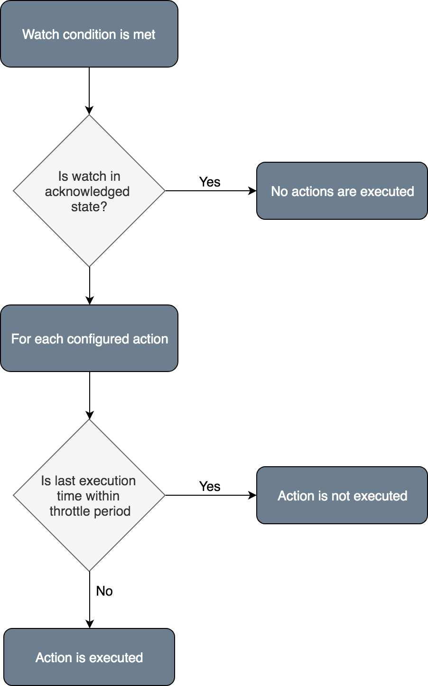

<!--- Copyright 2020 floragunn GmbH -->

# Throttling and Acknowledgement
{: .no_toc}



Signals supports both time-based and acknowledgement based throttling.

The purpose of throttling is to prevent any action to be executed too many times, thus generating too many notifications.

Assume you have a watch that is executed every second. If the condition of the watch is met, the configured action would also fire every second. Which means a notification is generated every second.

Time-based throttling enables you to limit the execution of an action based on a time interval: Even if the watch is executed every second, the action only fires every n seconds/minutes/hours etc.

Acknowledge-based throttling enables you to "silence" a watch which currently fires.  

## Time-based throttling

To throttle the execution of an action, you can set a `throttle_period` in the action definition:

```json
 {
	"actions": [
		{
			"type": "email",
			"name": "my_email_action",
			"throttle_period": "1h",
			"account": "internal_mail",
			"to": "notify@example.com",
			"subject": "...",
			"text_body": "..."
		}
	]
}
```

In this example, regardless how often the condition in the watch definition fires, the email action will be executed only once per hour.

On other words, if you define a throttle period, the action will not fire if the last time the action was executed is withing the timeframe of the throttle period.

## Acknowledgement

Acknowledging a watch that currently fires will prevent any action from being executed again. If a watch is [acknowledged via the REST API](rest_api_watch_acknowledge.md), it will move into the `acknowledged` state. As long as a watch is in `acknowledged` state, no actions will be executed.

This is useful in a situation where a watch condition is met, and you want to acknowledge that someone has noticed it and is working on solving the issue. 

A watch will remain in the `acknowledged` state until the watch condition evaluates to `false`, i.e. the condition is not met. This will move the watch out of the `acknowledged` state, so the next time the condition is met, the actions will be executed again.

## Throttling flow

<p align="center">

</p>
