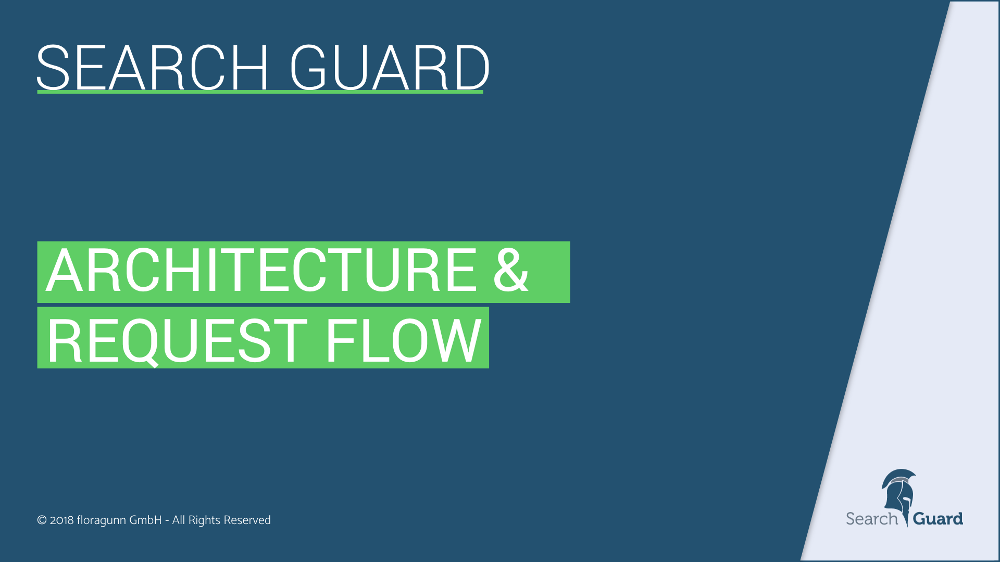
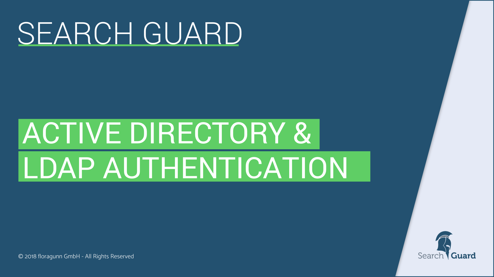
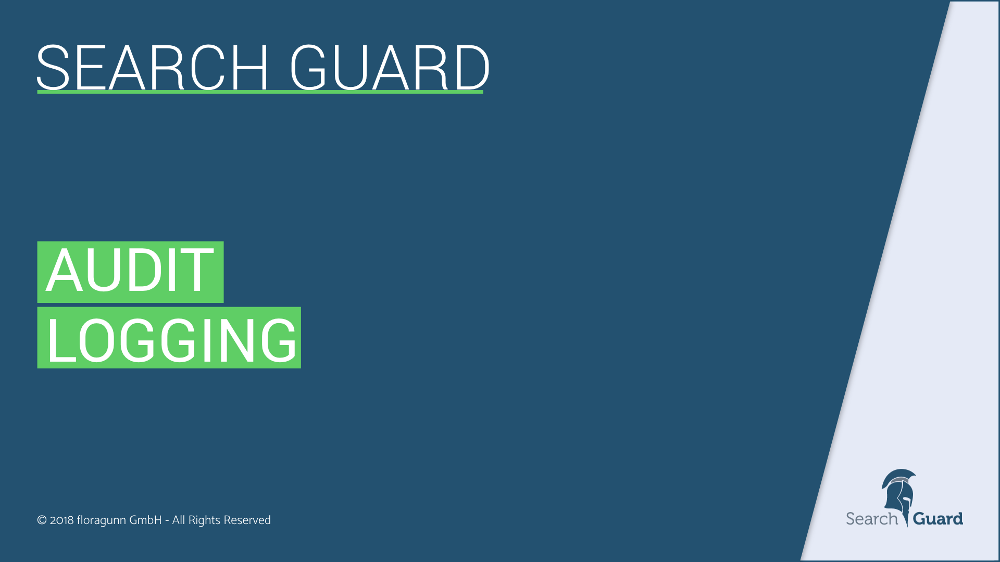

<!---
Copryight 2017 floragunn GmbH
-->
# Presentations

<h2 id="quickstart">Quickstart and first steps</h2>

	

		

			
		

		

			
How to use the Demo Installer to quickly set up a Search Guard PoC for Elasticsearch and Kibana. Use the Kibana config GUI to add users, roles and permissions. 

			<ul class="book-download-list">
				<li class="book-download-item">
					<a href="/resources/presentations/01_SG_Documents_installation.pdf" target="_blank">
						<i class="fa fa-file-pdf-o"></i> pdf  (920 KB) </a>
				</li>
			</ul>
		

	

<h2 id="architecture-request-flow">Architecture and Request Flow</h2>

	

		

			
		

		

			
A high-level view on the Search Guard architecture and the request flow. This presentation describes the main concepts of Search Guard and how security is implemented.

			<ul class="book-download-list">
				<li class="book-download-item">
					<a href="/resources/presentations/02_SG_Documents_architecture_request_flow.pdf" target="_blank">
						<i class="fa fa-file-pdf-o"></i> pdf  (2,6 MB) </a>
				</li>
			</ul>
		

	

<h2 id="configuration-basics">Configuration Basics</h2>

	

		

			
		

		

			
This deck describes how the Search Guard configuration for users, roles and permissions is structured, and explains how to apply configuration changes.

			<ul class="book-download-list">
				<li class="book-download-item">
					<a href="/resources/presentations/03_SG_Documents_configuration_basics.pdf" target="_blank">
						<i class="fa fa-file-pdf-o"></i> pdf  (330 KB) </a>
				</li>
			</ul>
		

	

<h2 id="active-directory-ldap">Active Directory & LDAP</h2>

	

		

					
		

		

			
How to connect Search Guard to an Active Directory or LDAP server, and how to configure authentication and authorization.

			<ul class="book-download-list">
				<li class="book-download-item">
					<a href="/resources/presentations/04_SG_Documents_active_directory_ldap.pdf" target="_blank">
						<i class="fa fa-file-pdf-o"></i> pdf  (342 KB) </a>
				</li>
			</ul>
		

	

<h2 id="json-web-tokens">JSON web tokens</h2>

	

		

					
		

		

			
How to use JSON web tokens for Elasticsearch single sign on authentication

			<ul class="book-download-list">
				<li class="book-download-item">
					<a href="/resources/presentations/05_SG_Documents_json_web_tokens.pdf" target="_blank">
						<i class="fa fa-file-pdf-o"></i> pdf  (300 KB) </a>
				</li>
			</ul>
		

	

<h2 id="audit-logging">Audit logging</h2>

	

		

					
		

		

			
Use Search Guard audit logging to track access to your cluster and to stay compliant with regulations like PCI, HIPAA, SOX, GDPR and ISO.

			<ul class="book-download-list">
				<li class="book-download-item">
					<a href="/resources/presentations/06_SG_Documents_auditlogging.pdf" target="_blank">
						<i class="fa fa-file-pdf-o"></i> pdf  (350 KB) </a>
				</li>
			</ul>
		

	

<h2 id="dls-fls">Document- and Field-Level Security</h2>

	

		

					
		

		

			
How to apply fine-grained access control to documents and fields in indices. Filter documents and filter or anonymize fields based on the users roles.

			<ul class="book-download-list">
				<li class="book-download-item">
					<a href="/resources/presentations/07_SG_Documents_document_and_field_level_security.pdf" target="_blank">
						<i class="fa fa-file-pdf-o"></i> pdf  (320 KB) </a>
				</li>
			</ul>
		

	

