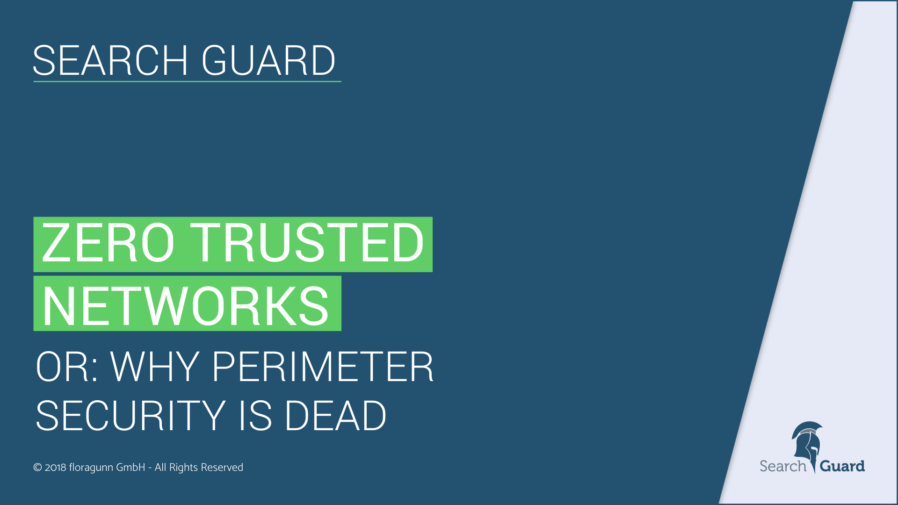

<!---
Copryight 2017 floragunn GmbH
-->
# Security Presentations

<h2 id="zero-trusted-networks">Zero-trusted networks: Perimeter security is dead</h2>

	

		

			
		

		

			
 Enterprises are struggling to prevent data breaches. Using conventional approaches, they invest a lot of time and energy to protect their networks from outside attacks. VPNs and firewalls are the norms, but perimeter security is not enough anymore. The Zero Trust Security model moves access control mechanisms from the network perimeter to the actual users, devices, and systems. 

			<ul class="book-download-list">
				<li class="book-download-item">
					<a href="/resources/presentations/Zero_Trusted_Networks.pdf" target="_blank">
						<i class="fa fa-file-pdf-o"></i> pdf  (150 KB) </a>
				</li>
			</ul>
		

	

