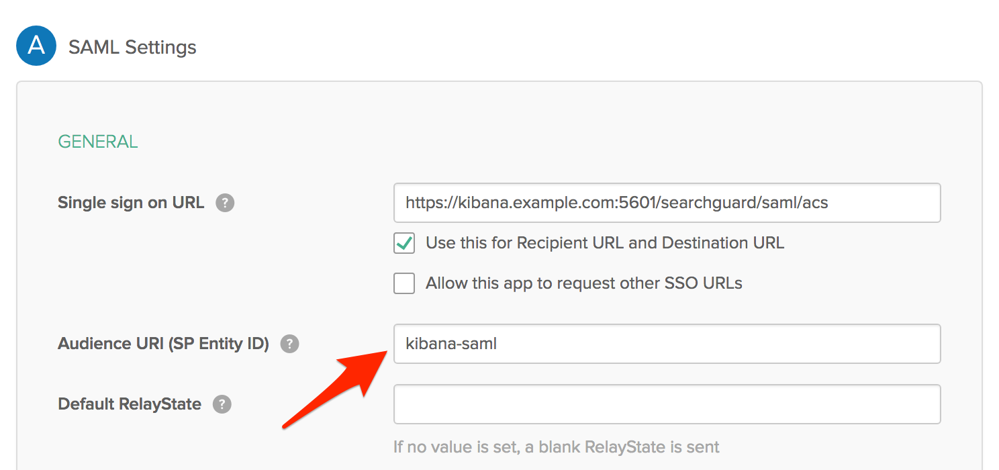

<!--- Copyright 2019 floragunn GmbH -->

# SAML troubleshooting

If you encounter any problems while using SAML, please check the following steps to pinpoint the problem. 

## Check the sp.entity_id

Most IdPs allow you to configure multiple authentication methods for different client applications. For example, in Okta these are called "Applications", in Keycloak they are called "Clients". Each of these applications has their entity ID. Make sure to configure the `sp.entity_id` to match your settings.

Keycloak example:

<p align="center">

</p>

Okta example: 

<p align="center">

</p>

Search Guard configuration:

```
saml:
   ...
   http_authenticator:
      type: 'saml'
      challenge: true
      config:
        ...
        sp:
          entity_id: kibana-saml
```
                    
## Check the SAML Assertion Consumer Service URL

After a successful login, your IdP sends a SAML Response via HTTP POST to the so-called "Assertion Consumer Service URL" of Kibana.

The endpoint Search Guard Kibana plugin provides is:

```
/searchguard/saml/acs
```

Make sure that you have configured this endpoint correctly in your IdP. Some IdPs also require you to whitelist all endpoints it will send requests to. Make sure the ACS endpoint is listed.

Okta example: 

<p align="center">

</p>

Kibana also requires you to whitelist this endpoint. Make sure you have the following entry in your `kibana.yml`:

```
server.xsrf.whitelist: [/searchguard/saml/acs]
```

## Make sure all documents are signed

Some IdPs do not sign the SAML documents by default. Make sure the IdP signs all documents.

Keycloak example:

<p align="center">

</p>

## Role settings

How to include user roles in the SAML response is highly dependant on the IdP. For example, in Keycloak this is configured in the Mappers section of your client. With Okta you have to set group attribute statements. Make sure this is configured correctly, and the role_key in the SAML configuration matches the role name in the SAML response.

Keycloak example:

<p align="center">

</p>

Okta example:

<p align="center">

</p>

Search Guard configuration:

```
saml:
   ...
   http_authenticator:
      type: 'saml'
      challenge: true
      config:
        ...
        roles_key: Role
```

## Inspecting the SAML Response

If you are not sure how the SAML Response of your IdP looks like and where it places the username and roles, you can enable the token debug mode in the `log4j2.properties` like:

```
logger.token.name = com.floragunn.dlic.auth.http.saml.Token
logger.token.level = debug
```

This will print out the SAML response in the Elasticsearch log file so you can inspect and debug it. Setting this logger to `debug will generate a lot of statements, so it's not recommended to do it in production. Log levels can also be changed at run time, please see the [Elasticsearch official documentation](https://www.elastic.co/guide/en/elasticsearch/reference/current/logging.html){:target="_blank"} on how to do that.

Another way of inspecting the SAML Response is to montitor the network traffic while logging in to Kibana. The IdP will HTTP POST the base64-encoded SAML Response to:

```
/searchguard/saml/acs
```

Inspect the payload of this POST request and use a tool like [https://www.base64decode.org/](https://www.base64decode.org/) to decode it.

## Checking the role mapping: NamedID and Roles

Search Guard uses the normal [role mapping](../_docs_roles_permissions/configuration_roles_mapping.md) to map a user or a backed role to one or more Search Guard roles.

For the username Search Guard uses the NameID attribute of the SAML Response by default. For some IdPs, this attribute does not contain the expected username, but some internal user id. Please check the content of the SAML Response to locate the element you want to use as username, and configure it by setting the subject_key in the SAML configuration:

```
saml:
   ...
   http_authenticator:
      type: 'saml'
      challenge: true
      config:
        ...
        subject_key: preferred_username
```

For checking that the correct roles are contained in the SAML Response, inspect the contents as well and set the correct attribute name like:

```
saml:
   ...
   http_authenticator:
      type: 'saml'
      challenge: true
      config:
        ...
        roles_key: Role
```

## Inspecting the JWT token

Search Guard trades the heavyweight SAML response for a more lightweight JSON web token. The username and roles in the JWT are ultimately mapped to Search Guard roles. If there is a problem with the mapping, you can enable the token debug mode in the `log4j2.properties` like:

```
logger.token.name = com.floragunn.dlic.auth.http.saml.Token
logger.token.level = debug
```

This will print the JWT in the logfile. You can then decode the JWT and inspect its content, for example by using [https://jwt.io/](https://jwt.io/). 
